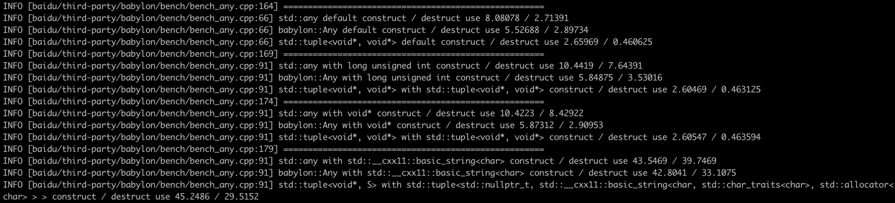

**[[简体中文]](any.zh-cn.md)**

# any

## Overview

`babylon::Any` is a general-purpose container that supports type erasure, similar to `std::any`, but with additional features.

1. **Reference Capability**: The container can choose not to hold the instance itself but record a reference (pointer). In contrast, `std::any` can only implement references by holding a `T*`. This makes it difficult for users to treat `std::any` holding an object and one holding a reference uniformly when using `std::any_cast`. `babylon::Any` uses specialized reference support to eliminate the distinction between holding the object and holding a reference for the user.
2. **Pointer Transfer**: The container can accept externally constructed instances and directly retain their pointers. Unlike `std::any`, which only supports creating a new instance (via move, copy, or in-place construction), `babylon::Any` supports pointer transfer, useful in cases where instances are non-movable, non-copyable, or constructed via factory functions.
3. **Cascading Type Erasure**: Besides the `<T>` version for transfers and references, the container also supports a type-erased version (`const Descriptor*`, `void*`), enabling interoperability with other type-erased containers.

## Usage

```c++
#include "babylon/any.h"

using ::babylon::Any;

// Copy Assignment
{
    Object obj;
    Any any; // Create an empty container
    any = obj; // Copy-construct a new Object into the container
}
// Move Assignment
{
    Object obj;
    Any any; // Create an empty container
    any = ::std::move(obj); // Move-construct a new Object into the container
}
// Explicit pointer transfer with unique_ptr; supports objects that cannot be refactored to support move/copy, such as those from legacy components
{
    Object* obj = create(); // Assume obj is constructed via a factory function, which is non-extensible, non-copyable, and non-movable.
    Any any; // Create an empty container
    any = ::std::unique_ptr<Object>(obj); // Wrap obj in a unique_ptr and move it into the container, retaining control over the instance
}
// Reference external objects; the container does not hold the object itself or manage its lifetime, providing a unified view in some frameworks
{
    Object obj;
    Any any; // Create an empty container
    any.ref(obj); // Store a reference to obj, while ensuring the user manages its lifecycle
    any.cref(obj); // Similar to ref but ensures the object is immutable, preventing the retrieval of non-const pointers
}
// Retrieving values: All assignment methods appear identical to the consumer
{
    Object* pobj = any.get<Object>(); // Retrieve a pointer to the stored object, only if the exact type matches (no base/derived type conversion).
                                      // cref ensures that mutable references are not retrievable, returning nullptr instead.
    const Object* pobj = ((const Any&)any).get<Object>(); // Retrieves a constant pointer, bypassing cref restrictions.
    const Object* pobj = any.cget<Object>(); // Shortcut for retrieving a constant pointer (cget follows STL naming conventions).
    if (pobj != nullptr) { // Returns nullptr if no content is stored, types do not match, or cref blocks mutable access
        pobj->func_in_obj();
    }
}
// Primitive type specialization
{
    Any any; // Create an empty container
    any = (int32_t) 123; // Explicitly store an int32_t value
    int64_t* pv = any.get<int16_t>(); // Returns nullptr, as the types are not strictly identical
    int64_t v = any.as<int64_t>(); // Converts and returns 123
    // Automatic conversion is supported for bool, int8-64, uint8-64, float, and double
}

// Type erasure
{
    auto desc = Any::descriptor<Object>();    // Retrieve the Descriptor for Object
    void* ptr = get_from_some_type_erased_container();    // Get an untyped pointer to an Object instance
    Any any;
    any.ref(desc, ptr);    // Reference the pointer, treating it as an Object; the user must ensure that ptr points to an actual Object
                           // Typically, ptr comes from another type-erasure mechanism, and desc is stored alongside it for future retrieval
    any.assign(desc, ptr); // Similar to ref, but transfers ownership, analogous to assigning a unique_ptr of Object
}
```

## Performance Comparison

`babylon::Any` has the same size as `std::any`, consisting of a type accessor and a real instance pointer.


For both primitive and instance types, construction and destruction performance is on par with `std::any`.



Access is optimized through lightweight checks and reduced reliance on virtual functions, providing a performance boost.


