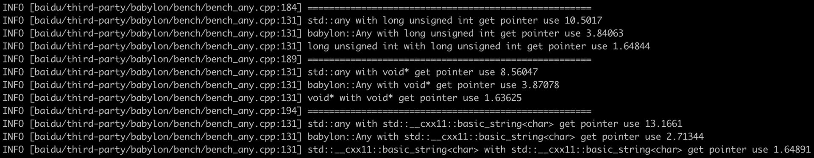

**[[English]](any.en.md)**

# any

## 原理

提供类型擦除支持的通用容器，可以对标std::any，但是增加了一些功能支持

1. 引用能力，容器可以选择不持有类型实例本身，而只是记录一个引用关系（指针）。对于std::any来说只能采用T*通过持有指针的方式实现引用，但是这样持有本体和持有引用的std::any对于std::any_cast的使用者就无法统一对待。babylon::Any通过特化的引用支持做到了对使用者消除本体和引用的差异
2. 指针转移，容器可以接收外部构造好的实例，并将指针直接保留下来。对于std::any来说，只支持（移动/拷贝/原地）构造一个新实例并持有的模式。对于一些特殊的既无法移动，又无法拷贝，或只能通过已有工厂构造的实例就无法持有了。babylon::Any通过特化的指针转移功能支持了这些特殊情况
3. 类型擦除级联，容器的转移和引用能力除了提供<T>版本外，还提供类型擦除版本（const Descriptor*, void*），可以用于和其他类型擦除容器互通

## 使用方法

```c++
#include "babylon/any.h"

using ::babylon::Any;

// 拷贝赋值
{
    Object obj;
    Any any; // 创建空容器
    any = obj; // 拷贝构造新Object存放到any中
}
// 移动赋值
{
    Object obj;
    Any any; // 创建空容器
    any = ::std::move(obj); // 移动构造新Object存放到any中
}
// 显式使用unique_ptr进行指针转移；可以支持无法改写成支持移动/拷贝赋值的对象，比如来自某个既有且无法改写的组件
{
    Object* obj = create(); // obj构造自一个既有的工厂型函数，用来演示不支持用户自己扩展，自身又不支持拷贝或者移动的实例
    Any any; // 创建空容器
    any = ::std::unique_ptr<Object>(obj); // 包装成unique_ptr【移动】（注意只能移动，因为要转移唯一控制权）到any中，不会也不需要构造新对象，obj的本体指针会被直接保存在any中
}
// 引用外部对象，本体不保存在any中，也不由any控制其生命周期；一方面提供强类型动态指针的能力，另一方面在一些框架实现中，向使用者提供统一视图
{
    Object obj;
    Any any; // 创建空容器
    any.ref(obj); // 引用到any中，实际还是操作obj，且需要使用者保证obj的生命周期
    any.cref(obj); // 和ref基本相同，但是会记录any不可修改obj，取值者无法尝试拿到非const指针
}
// 取值，上面所有赋值方式，对取值者看来是无差别的
{
    Object* pobj = any.get<Object>(); // 指定严格一致的类型才可取到指针（使用父类/子类/可转换的其他数值类型均【无法取得】指针，即会取得nullptr）
                                      // 对于cref的obj，为了满足不可变引用的承诺，会返回nullptr
    const Object* pobj = ((const Any&)any).get<Object>(); // 和get基本相同，但是可以因为尝试获取的是常量指针，不受cref特殊性的限制
    const Object* pobj = any.cget<Object>(); // 常量指针get的简写，模仿stl的c开头风格
    if (pobj != nullptr) { // 没有存入内容/类型不匹配/尝试获取cref的非const指针，会返回nullptr
        pobj->func_in_obj();
    }
}
// 原始类型特化
{
    Any any; // 创建空容器
    any = (int32_t) 123; // 显式放入int32_t类型
    int64_t* pv = any.get<int16_t>(); // nullptr，因为类型没有严格一致
    int64_t v = any.as<int64_t>(); // 123，可以自动转换
    // 自动转换支持bool, int8 - 64, uint8 - 64, float, double
}

// 类型擦除
{
    auto desc = Any::descriptor<Object>();    // 获得Object的Descriptor
    void* ptr = get_from_some_type_erased_container();    // 获得某个Object类型的无类型指针
    Any any;
    any.ref(desc, ptr);    // 构造一个相当于明确ref到Object类型的any，使用这需要保证ptr确实是一个Object类型的指针
                           // 一般ptr来自于另一个类型擦除机制，该机制可以在最初的捕获场景同步存储一个desc下来一起保存
                           // 在需要呈现为any时，和实例指针成对使用即可对接到babylon::Any
    any.assign(desc, ptr)  // 除了引用，也可以支持生命周期转移，相当于明确operator=到Object类型std::unique_ptr
}
```

## 性能对比

本体和std::any大小相同，均为一个类型访问器 加 一个真实实例指针构成


对于基本类型和实例类型的构造和析构不弱于std::any


访问上通过设计较轻量的跳转判断和尽量避开虚函数获得一定加速


