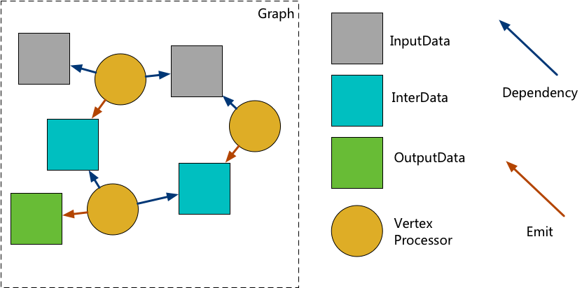

**[[简体中文]](README.zh-cn.md)**

# anyflow

`anyflow` is a component-based parallel computing framework that achieves parallelism by breaking down a computing task into a series of sub-tasks, which are then organized in a Directed Acyclic Graph (DAG).

Unlike traditional DAG-based parallel frameworks, in `anyflow`, the sub-tasks are not directly connected. Instead, the framework introduces the concept of **data nodes** to explicitly represent the data flow between sub-tasks. This explicit data flow representation eliminates implicit data dependencies between sub-tasks, reducing the coupling between them. Moreover, through the intermediary data nodes, `anyflow` enables advanced features such as partial execution, conditional execution, and micro-pipeline interaction.

## Documentation

- [Design](design.pdf)(chinese version only)
- [Overview](overview.en.md)
- [Quick Start Guide](quick_start.en.md)
- [Builder](builder.en.md)
- [Graph](graph.en.md)
- [Processor](processor.en.md)
- [Expression](expression.en.md)
