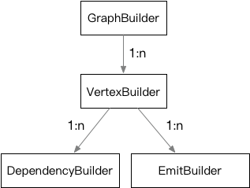

**[[简体中文]](builder.zh-cn.md)**

# Builder

## Hierarchical Structure



Builder is the composition component of the graph engine, consisting of a group of objects. `GraphBuilder` serves as the main entry point.

- Using `add_vertex` on `GraphBuilder` returns a `GraphVertexBuilder`.
- On `GraphVertexBuilder`, you can call `(named_depend | anonymous_depend)` or `(named_emit | anonymous_emit)` to obtain `GraphDependencyBuilder` and `GraphEmitBuilder`.
- These builders allow detailed configuration of the graph. The builder functions typically return a reference to the object itself to enable method chaining.

## GraphBuilder

```c++
#include "babylon/anyflow/builder.h"

using babylon::anyflow::Graph;
using babylon::anyflow::GraphBuilder;
using babylon::anyflow::GraphExecutor;
using babylon::anyflow::GraphVertexBuilder;

// GraphBuilder can be initialized using the default constructor
GraphBuilder builder;

// Set a name, mainly used for logging and identification
builder.set_name("NameOfThisGraph");

// When the final graph is executed, ready nodes will be submitted for execution via the GraphExecutor
// The default is to use the InplaceGraphExecutor, which executes all nodes sequentially in the current thread
GraphExecutor& executor = get_some_useful_executor();
builder.set_executor(executor);

// The only graph construction operation on GraphBuilder is adding a new vertex (node),
// which returns a reference to the corresponding `GraphVertexBuilder` for that node.
// A factory function for the `GraphProcessor` is required to implement the actual functionality of the node.
// Further node settings can be done via the returned `GraphVertexBuilder`.
// The returned `GraphVertexBuilder` is maintained within the `GraphBuilder`.
GraphVertexBuilder& vertex_builder = builder.add_vertex([] {
    return std::make_unique<SomeUsefulGraphProcessor>();
});

... // Continue constructing the graph until completion

// Finish the graph construction. This will analyze and validate the existing information.
// It returns 0 on success, or a non-zero value in case of errors such as conflicting outputs or type mismatches.
// After calling this method, no further non-const operations are allowed on the graph.
// The only subsequent action typically is repeatedly using `build` to obtain executable graph instances.
int return_code = builder.finish();

// Returns a newly constructed `Graph` instance.
// A `Graph` instance can only be executed exclusively, but it can be reused.
// Typically, threads or object pools can be used to support concurrency.
// The `Graph` will reference members of the builder, so the builder must remain alive until all graphs created by `build` are destroyed.
// The builder itself can be managed using a singleton pattern or similar.
::std::unique_ptr<Graph> graph = builder.build();
```

## GraphVertexBuilder

```c++
#include "babylon/anyflow/builder.h"

using babylon::anyflow::GraphDependencyBuilder;
using babylon::anyflow::GraphEmitBuilder;
using babylon::anyflow::GraphVertexBuilder;

// `GraphVertexBuilder` is obtained via `GraphBuilder::add_vertex`
GraphVertexBuilder& vertex_builder = builder.add_vertex(processor_creator);

// Add a new named dependency
// `local_name` corresponds to the input member name defined in the `GraphProcessor` via `ANYFLOW_INTERFACE`.
// Calling `named_depend` with the same `local_name` returns the same `GraphDependencyBuilder` instance.
// Further settings can be done through the returned `GraphDependencyBuilder`.
// The `GraphDependencyBuilder` is maintained within the `GraphVertexBuilder`.
GraphDependencyBuilder& named_dependency_builder = vertex_builder.named_depend("local_name");

// Add a new anonymous dependency, supporting advanced variadic input features.
// In the `GraphProcessor`, the data can be accessed by index through `vertex().anonymous_dependency(index)`.
// Similarly, a `GraphDependencyBuilder` is returned for further configuration.
GraphDependencyBuilder& anonymous_dependency_builder = vertex_builder.anonymous_depend();

// Add a new named emit (output).
// `local_name` corresponds to the output member name defined in the `GraphProcessor` via `ANYFLOW_INTERFACE`.
// Calling `named_emit` with the same `local_name` returns the same `GraphEmitBuilder` instance.
// Further settings can be done through the returned `GraphEmitBuilder`.
// The `GraphEmitBuilder` is maintained within the `GraphVertexBuilder`.
GraphEmitBuilder& named_emit_builder = vertex_builder.named_emit("local_name");

// Add a new anonymous emit (output), supporting advanced variadic output features.
// In the `GraphProcessor`, the data can be accessed by index through `vertex().anonymous_emit(index)`.
// Similarly, a `GraphEmitBuilder` is returned for further configuration.
GraphEmitBuilder& anonymous_emit_builder = vertex_builder.anonymous_emit();

// Set configuration data for the vertex. The data will be moved or copied into the `vertex_builder`.
// In the `GraphProcessor`, the config can be further processed via the `config` function and finally obtained via the `option` function.
// This is mainly used to customize the behavior of the `GraphProcessor`.
// The `option` can support any type, though it is typically a configuration file format like JSON or YAML.
AnyTypeUseAsOption option;
vertex_builder.option(::std::move(option));
```

## GraphDependencyBuilder

```c++
#include "babylon/anyflow/builder.h"

using babylon::anyflow::GraphDependencyBuilder;

// `GraphDependencyBuilder` is obtained via `GraphVertexBuilder::named_depend` and `GraphVertexBuilder::anonymous_depend`
GraphDependencyBuilder& dependency_builder = vertex_builder.named_depend("local_name");
GraphDependencyBuilder& dependency_builder = vertex_builder.anonymous_depend();

// Set the dependency target to the globally named data `target_name`.
// The output with the same target name in `GraphEmitBuilder` will be connected together.
dependency_builder.to("target_name");
```

## GraphEmitBuilder

```c++
#include "babylon/anyflow/builder.h"

using babylon::anyflow::GraphEmitBuilder;

// `GraphEmitBuilder` is obtained via `GraphVertexBuilder::named_emit` and `GraphVertexBuilder::anonymous_emit`
GraphEmitBuilder& emit_builder = vertex_builder.named_emit("local_name");
GraphEmitBuilder& emit_builder = vertex_builder.anonymous_emit();

// Set the output target to the globally named data `target_name`.
// The output with the same target name in `GraphDependencyBuilder` will be connected together.
emit_builder.to("target_name");
``` 
