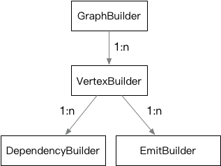

**[[English]](builder.en.md)**

# builder

## 层次关系



Builder是图引擎的构图组件，由一组对象组成，GraphBuilder为整体入口

- 在GraphBuilder上add_vertex可以得到一个GraphVertexBuilder
- 在GraphVertexBuilder上（named_depend | anonymous_depend）或（named_emit | anonymous_emit）可以进一步得到GraphDependencyBuilder和GraphEmitBuilder
- 这些Builder可以用来对对应的图进行详细设置，Builder的设置函数风格一般会返回自身引用用于级联简写

## GraphBuilder

```c++
#include "babylon/anyflow/builder.h"

using babylon::anyflow::Graph;
using babylon::anyflow::GraphBuilder;
using babylon::anyflow::GraphExecutor;
using babylon::anyflow::GraphVertexBuilder;

// GraphBuilder使用默认构造获得
GraphBuilder builder;

// 设置名字，主要用于日志打印标识
builder.set_name("NameOfThisGraph");
 
// 最终Graph运行时，就绪节点会通过GraphExecutor提交执行
// 默认使用InplaceGraphExecutor，会使用当前线程串行执行所有节点
GraphExecutor& executor = get_some_useful_executor();
builder.set_executor(executor);
 
// GraphBuilder上唯一的构图操作，即增加一个新的节点，会返回这个新增节点对应的GraphVertexBuilder的引用
// 需要传入一个GraphProcessor的工厂函数用于实现该节点的实际功能
// 进一步的节点设置通过这个GraphVertexBuilder进行交互
// 返回的GraphVertexBuilder本身【维护】在GraphBuilder当中
GraphVertexBuilder& vertex_builder = builder.add_vertex([] {
    return std::make_unique<SomeUsefulGraphProcessor>();
});

... // 继续构图直到结束

// 结束构图，此时会对已有信息进行分析和校验，正确完成时会返回0
// 对于竞争输出，类型不匹配等异常情况会返回非0
// 调用后【不能再执行任务非const操作】，典型之后的操作只有反复通过build来获取可执行的图实例
int return_code = builder.finish();
 
// 返回构建好一个新的Graph实例
// Graph实例只能独占执行，但可以重复使用，一般可以通过线程变量或者对象池来支持并发
// Graph中会引用builder中的成员，因此在所有build获得的graph销毁前，builder要保持存活
// builder自身可以使用单例等方式进行管理
::std::unique_ptr<Graph> graph = builder.build();
```

## GraphVertexBuilder

```c++
#include "babylon/anyflow/builder.h"

using babylon::anyflow::GraphDependencyBuilder;
using babylon::anyflow::GraphEmitBuilder;
using babylon::anyflow::GraphVertexBuilder;

// GraphVertexBuilder通过GraphBuilder::add_vertex获得
GraphVertexBuilder& vertex_builder = builder.add_vertex(processor_creator);
 
// 增加一个新的命名依赖
// local_name对应GraphProcessor中使用ANYFLOW_INTERFACE定义的输入成员名
// 使用相同的local_name调用named_depend会得到相同的GraphDependencyBuilder实例
// 进一步的设置可以通过返回的GraphDependencyBuilder完成
// GraphDependencyBuilder本身【维护】在GraphVertexBuilder当中
GraphDependencyBuilder& named_dependency_builder = vertex_builder.named_depend("local_name");
 
// 增加一个新的匿名依赖，支持高级的变参输入功能
// GraphProcessor中可以通过vertex().anonymous_dependency(index)采用序号方式获得对应的数据
// 同样会返回GraphDependencyBuilder用于进一步设置
GraphDependencyBuilder& anonymous_dependency_builder = vertex_builder.anonymous_depend();
 
// 增加一个新的命名输出
// local_name对应GraphProcessor中使用ANYFLOW_INTERFACE定义的输入成员名
// 使用相同的local_name调用named_emit会得到相同的GraphEmitBuilder实例
// 进一步的设置可以通过返回的GraphEmitBuilder完成
// 返回的GraphEmitBuilder本身【维护】在GraphVertexBuilder当中
GraphEmitBuilder& named_emit_builder = vertex_builder.named_emit("local_name");
 
// 增加一个新的匿名输出，支持高级的变参输出功能
// GraphProcessor中可以通过vertex().anonymous_emit(index)采用序号方式获得对应的数据
// 同样会返回GraphEmitBuilder用于进一步设置
GraphEmitBuilder& anonymous_emit_builder = vertex_builder.anonymous_emit();
 
// 设置节点的配置数据，配置数据会被移动或拷贝到vertex_builder中
// GraphProcessor可以通过config函数对其再加工，并最终通过option函数获取
// 主要用来支持GraphProcessor的具体行为可定制
// option可以支持任意类型，不过典型为某种配置文件格式，例如json/yaml等
AnyTypeUseAsOption option;
vertex_builder.option(::std::move(option));
```

## GraphDependencyBuilder

```c++
#include "babylon/anyflow/builder.h"

using babylon::anyflow::GraphDependencyBuilder;
 
// GraphDependencyBuilder通过GraphVertexBuilder::named_depend和GraphVertexBuilder::anonymous_depend获得
GraphDependencyBuilder& dependency_builder = vertex_builder.named_depend("local_name");
GraphDependencyBuilder& dependency_builder = vertex_builder.anonymous_depend();
 
// 设置依赖的目标到全局名为target_name的数据
// 和GraphEmitBuilder中的目标名相同的输出会连接到一起
dependency_builder.to("target_name");
```

## GraphEmitBuilder

```c++
#include "babylon/anyflow/builder.h"

using babylon::anyflow::GraphEmitBuilder;

// GraphEmitBuilder通过GraphVertexBuilder::named_emit和GraphVertexBuilder::anonymous_emit获得
GraphEmitBuilder& emit_builder = vertex_builder.named_emit("local_name");
GraphEmitBuilder& emit_builder = vertex_builder.anonymous_emit();
 
// 设置输出的目标到全局名为target_name的数据
// 和GraphDependencyBuilder中的目标名相同的输出会连接到一起
emit_builder.to("target_name");
```
