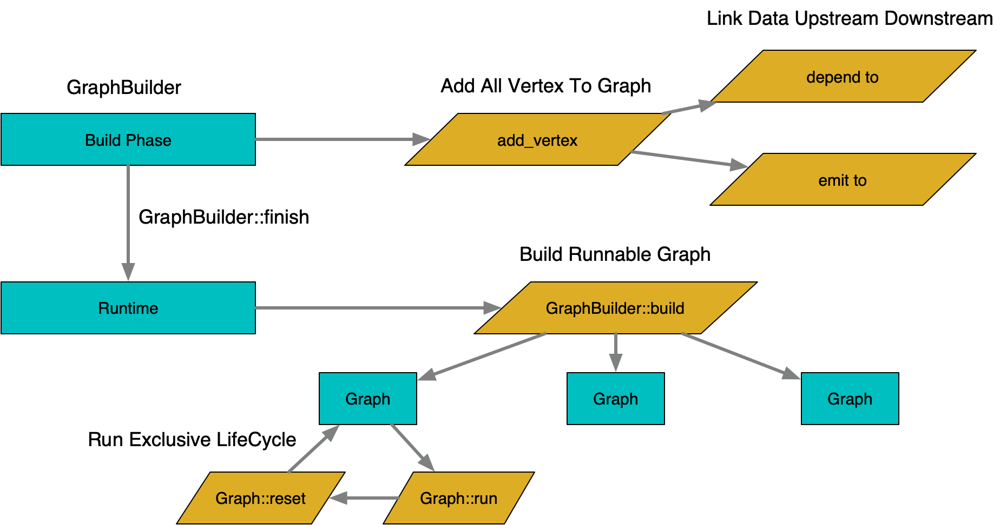
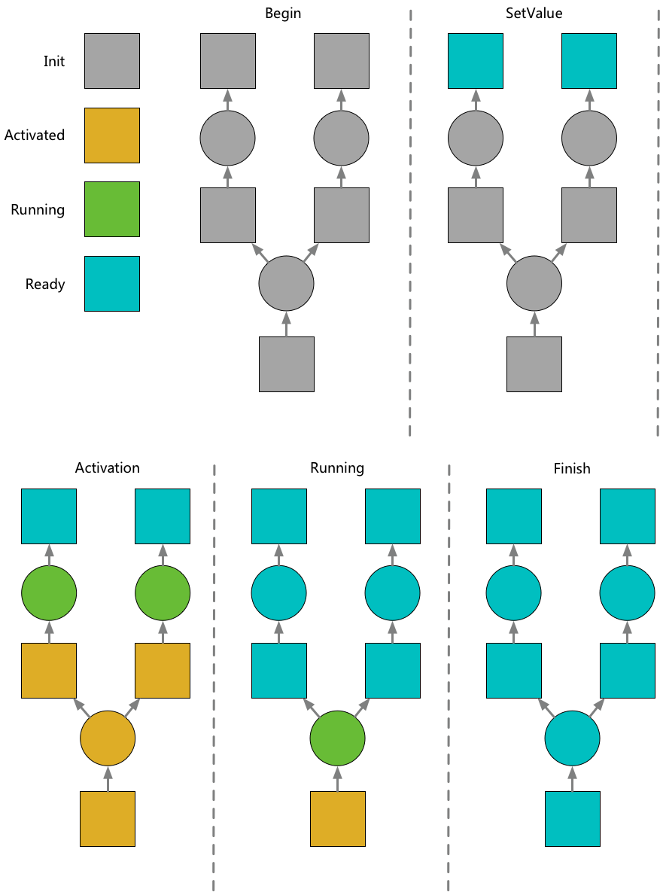
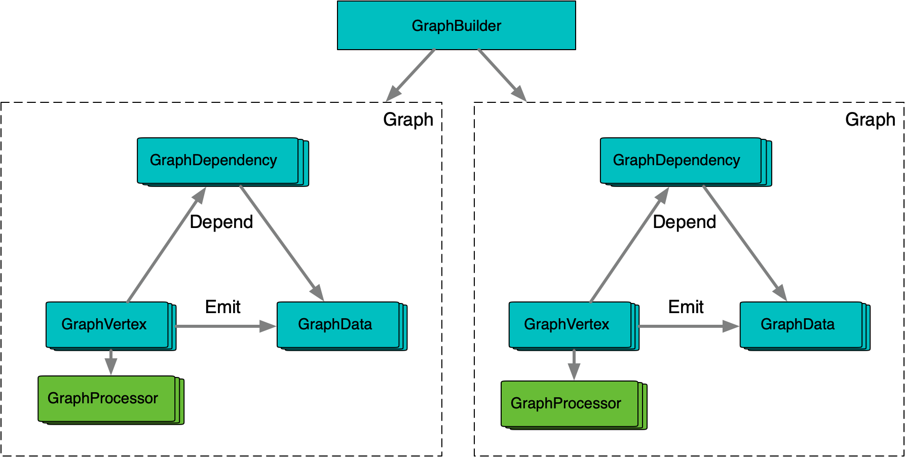
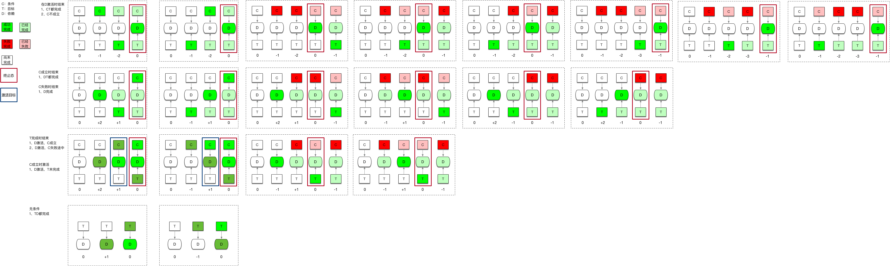

**[[简体中文]](overview.zh-cn.md)**

# Overview

## Basic Concepts

Conceptually, an execution graph consists of two types of entities: **data nodes** and **compute nodes**, which are connected by two types of relationships: **dependencies** and **outputs**.

- **Data Nodes**: These hold data, such as a string, an integer, or an object. Each data node can only have one compute node that **outputs** to it. Data nodes without an output from any compute node are typically input nodes of the entire graph and are injected from external sources.
  
- **Compute Nodes**: These hold a processing function, **depend** on multiple data nodes for input, and **output** their results to multiple data nodes after computation.

## Graph Construction

Graph construction occurs in two stages: **build time** and **run time**.

- **Build Time**: The graph structure is mutable, and nodes can be added or configured by calling graph-building APIs.
  
- **Run Time**: Once the graph is finalized, its structure becomes immutable, and no further changes can be made. At this stage, the graph can be used repeatedly by building instances that can be executed.

- **Execution Lifecycle**: A graph instance manages its execution state and needs to be used exclusively. After execution is complete, it can be reset and reused. To support concurrent execution, graph instances are typically pooled.

## Execution Process

The execution process consists of two main actions: **activation** and **execution**.

- **Activation**: The graph's execution starts by activating certain data nodes. Once a data node is activated, its **output** nodes and their **dependent** data nodes are recursively activated until all dependencies are satisfied. After activation, nodes with all dependencies ready enter the **execution** phase, which can occur in parallel.
  
- **Execution**: The result of a compute node's execution is reflected by sending outputs to downstream data nodes. When all of a compute node's dependent data nodes are ready, the node will start **executing**.

## Data Structure

- **GraphBuilder** & **Graph**: The `GraphBuilder` holds the static structure of the graph. Each time a graph is built, it creates a runtime instance. The runtime graph references some static information from the `GraphBuilder`, so their lifecycles must be managed carefully. The runtime graph contains dynamic activation and execution states, as well as the actual data nodes. Each runtime instance must be used exclusively, typically managed through a pooling mechanism.

- **GraphVertex**, **GraphDependency**, and **GraphData**: These represent compute nodes, data nodes, and their relationships. They store activation and execution states, as well as the actual data.

- **GraphProcessor**: Each `GraphVertex` has an exclusive `GraphProcessor`, allowing it to safely use member variables to manage intermediate data during computation.

## Lock-Free DAG Derivation Algorithm

In typical DAG execution, a global lock is used to establish a critical section, where state changes are performed. The `GraphEngine` employs a specialized design to avoid creating this critical section, theoretically improving concurrent DAG execution efficiency and supporting finer-grained, highly parallel DAG designs.

- **Dependency Counting**: Each dependency relationship maintains a state counter. Activation and execution are expressed through atomic state changes on this counter, and state transitions are determined based on the target value after the change.

- **Unconditional Dependencies**: Activation increments the counter by 1, and data readiness decrements it by 1. When any operation results in a value of 0, the dependency is considered ready.

- **Conditional Dependencies**: These are more complex because they can result in either a true or false state once ready. Activation increments the counter by 2, and readiness decrements it by 1. If the condition is true, readiness decrements the counter by another 1; if false, it decrements by 2. The final state after readiness will always be 0, while the final state after activation will be either -1 or 0, and the transition only triggers once.

This design ensures that activation and execution are derived without duplication or omission. The only operations are atomic state changes on individual dependencies, enabling high concurrency scalability.
