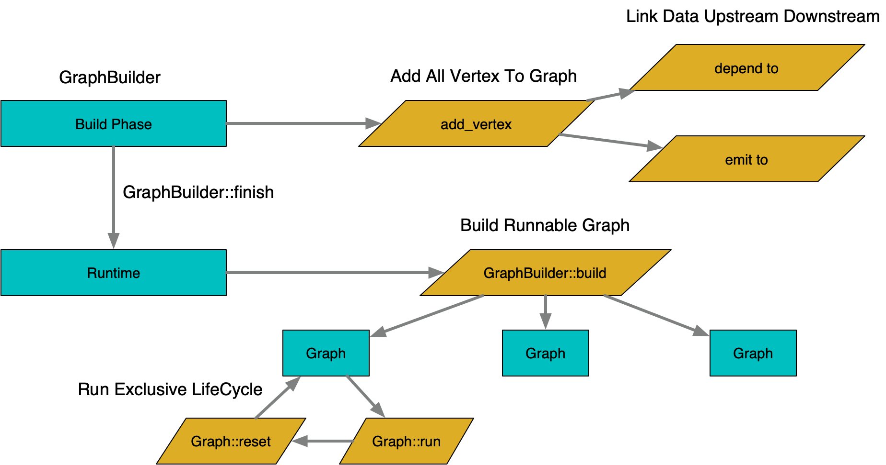
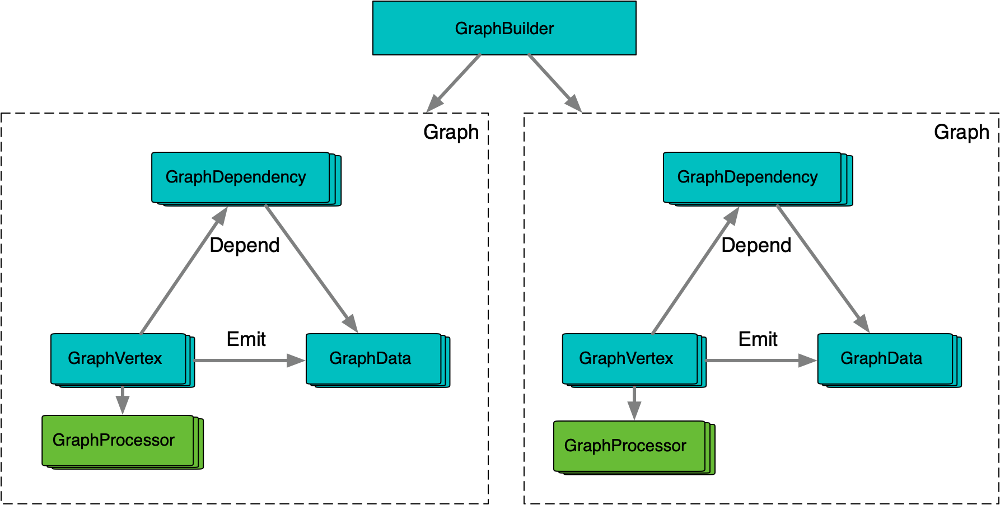

**[[English]](overview.en.md)**

# 概览

## 基础概念

逻辑上一张执行图由**数据节点**和**计算节点**两类实体构成，两类实体间由**依赖**和**输出**两种关系关联

**数据节点**：持有数据，例如实际存储一个string，一个int，一个object等；每个数据节点只能由一个计算节点**输出**，没有计算节点**输出**关联的数据节点，一般是图的整体输入数据节点，由外部注入

**计算节点**：持有一个处理函数，**依赖**多个数据节点，进行计算后，**输出**到多个数据节点

## 构图

构图分位两个阶段，**构建期**和**运行期**

**构建期**：图结构可变，可以调用构图相关的API进行节点的添加和设置

**运行期**：调用构图结束后，图结构固定，不再可以进行节点的添加和设置；运行期可以反复使用build获取可以运行的图实例

**执行生命周期**：图实例管理了运行状态，需要独占使用，但是运行完成后可以reset并重复利用；如果需要支持并发执行，一般需要对图实例进行池化

## 运行过程

运行流程包括**激活**和**执行**两个动作

**激活**：图运行从激活若干个数据节点开始，当数据节点激活后，会递归激活它的**输出**者，以及输出者的**依赖**数据节点，直到遇到已经就绪的数据节点为止；激活完毕后，所有依赖全部就绪的节点进入运行状态，可以并发开始**执行**

**执行**：计算节点的执行结果对外体现为向下游数据节点的**输出**，将数据节点转为就绪状态，如果已经激活的计算节点的依赖数据节点全部转为就绪后，计算节点会开始**执行**

## 数据结构

GraphBuilder & Graph：GraphBuilder持有图静态结构信息，在每次build时会按照结构产生一个运行时图；运行时图部分静态信息引用GraphBuilder，因此需要保证生命周期；运行图除了结构信息，还包括动态的激活和执行状态，以及实际的数据节点，因此每次运行需要独占一个Graph实例，一般采用池化方式管理
GraphVertex & GraphDependency & GraphData：代表计算节点，数据节点和之前的关联，存储的激活和执行状态，以及实际的数据
GraphProcessor是每个GraphVertex独占持有的，因此可以安全地使用成员变量来管理计算中间数据；

## 无锁DAG推导算法

典型DAG演算过程一般是通过全局锁建立临界区，并在临界区内部完整状态变更；GraphEngine采用了特殊的设计避免了这个临界区的建立，理论上提升了DAG执行的并发效率，支持更细碎且并发度更高的DAG设计

依赖计数：在每个依赖关系上，维护着一个状态计数器，激活和执行都通过状态计数器的原子变更来表达，并通过变更后的目标值来做状态判定

无条件依赖：激活动作会做+1处理，数据就绪会做-1处理，任意操作完成如果得到0，则判定为依赖就绪

有条件依赖：相对复杂，因为条件就绪后可能存在真假两种状态；激活动作会做+2处理，目标就绪做-1处理，依赖就绪且成立做-1处理，依赖就绪且不成立做连续两次-1处理；根据上图穷举状态变更，以就绪动作结束的终太一定是0，而激活动作结束的终态有[-1, 0]两种，而且终态只会边沿触发一次

整体可以做到激活执行推导不重不丢，而过程中只有状态计数器的原子操作，而且分散在每个依赖关系上独立维护，并发可扩展性高
