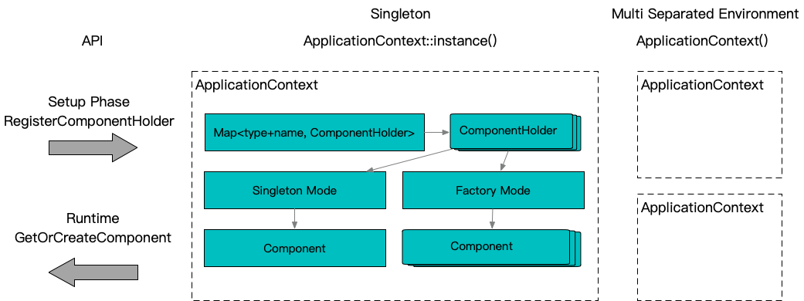
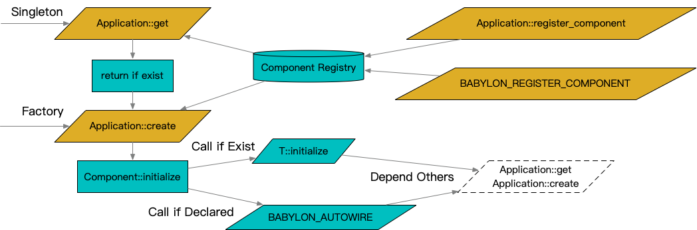

**[[English]](application_context.en.md)**

# application_context

## Principle



ApplicationContext: This is the core IOC container, typically implemented as a global singleton. If isolated component spaces are required, multiple containers can be created. It provides two API interfaces for external use: **register component** and **retrieve component**.

Register component: Registers a specific type of component into the container under a given name. A component can be registered with multiple base types simultaneously, allowing the user to retrieve the component using any of its base types.

Retrieve component: Retrieves a component from the container by its name and type. Components can share a reference through the **singleton pattern** or create independent instances via the **factory pattern**. **Component creation** is handled by the component itself, making the IOC model transparent to the user.



Component creation: When creating an instance, a component can retrieve its dependencies from the ApplicationContext, triggering a new retrieval process and continuing recursively until the entire dependency tree is resolved. Component creation and dependency resolution are implemented using **static reflection**.

Static reflection: The target component type does not need to inherit from a predefined framework base class. Instead, customization is achieved by checking whether the type provides a **protocol function**. The two protocol mechanisms for customization are **initialization** and **autowiring**.

Initialization: The initialization process is customized using the protocol function `initialize`. Four function signatures are supported. The passed-in ApplicationContext can be used to address further dependencies, and Any provides the necessary configuration for initialization. Returning `0` indicates success.
```c++
int initialize(ApplicationContext&, const Any&);
int initialize(ApplicationContext&);
int initialize(const Any&);
int initialize();
```

Autowiring: For dependencies that do not require dynamic configuration, autowiring can be simplified using the macro `BABYLON_AUTOWIRE` for declarative implementation.
```c++
class T {
  ...
  BABYLON_AUTOWIRE(
    BABYLON_MEMBER(DependType, _member1, "component name1")
    BABYLON_MEMBER(DependType, _member2, "component name2")
  )
};
```

## Usage

### Implementing a component

```c++
#include "babylon/application_context.h"

using ::babylon::ApplicationContext;

// Implementing a component
class SomeComponent : public SomeBase, public SomeOtherBase { // No need to inherit any framework-specific base class
  ... // Arbitrary code

  // [Optional] Define an initialization function
  // This can be used to initialize the component with configuration
  // and programmatically assemble dependencies
  int initialize(ApplicationContext& context, const Any& option) {
    // Retrieve other components by name and type
    auto other_component_pointer = context.get<OtherComponentType>("OtherComponentName");
    // Retrieve configuration (e.g., from YAML in production)
    auto config_pointer = option.get<SomeConfigType>();
    ... // Additional initialization steps
  }

  // [Optional] Declare dependency autowiring
  // If both autowiring and an initialization function are defined, autowiring runs first
  BABYLON_AUTOWIRE(
    // Define a member
    // ApplicationContext::ScopedComponent<OtherComponentType> _member_name;
    // And assemble as follows
    // _member_name = context.get_or_create<OtherComponentType>("OtherComponentName");
    BABYLON_MEMBER(OtherComponentType, _member_name, "OtherComponentName")
    ... // More autowiring
  )
};

// Register the component with the singleton ApplicationContext
BABYLON_REGISTER_COMPONENT(SomeComponent);                      // Register by type
BABYLON_REGISTER_COMPONENT(SomeComponent, "SomeComponentName"); // Register with a name
BABYLON_REGISTER_COMPONENT(SomeComponent, "SomeComponentName", SomeBase, SomeOtherBase, ...); // Register with a set of base types

// Register with factory mode, disabling singleton use
BABYLON_REGISTER_FACTORY_COMPONENT(SomeComponent);                      // Register by type
BABYLON_REGISTER_FACTORY_COMPONENT(SomeComponent, "SomeComponentName"); // Register with a name
BABYLON_REGISTER_FACTORY_COMPONENT(SomeComponent, "SomeComponentName", SomeBase, SomeOtherBase, ...); // Register with a set of base types

// Dynamic registration during program startup is also possible
ApplicationContext::instance().register_component(
  ApplicationContext::DefaultComponentHolder<SomeComponent, SomeBase>::create(),
  "SomeComponentName");
```

### Retrieving a component

```c++
#include "babylon/application_context.h"

using ::babylon::ApplicationContext;

// Singleton mode, returns SomeComponent*
// If it does not exist or fails to initialize, returns nullptr
instance = ApplicationContext::instance().get<SomeComponent>(); // Can be used if only one component of this type exists in the ApplicationContext
instance = ApplicationContext::instance().get<SomeComponent>("SomeComponentName"); // If multiple components of the same type exist, use the name to distinguish

// Factory mode, returns ApplicationContext::ScopedComponent<ScopedComponent>
// This is essentially a std::unique_ptr with a specialized deleter
// If it does not exist or fails to initialize, returns null
instance = ApplicationContext::instance().create<SomeComponent>();
instance = ApplicationContext::instance().create<SomeComponent>("SomeComponentName");

// Compatibility mode, returns ApplicationContext::ScopedComponent<ScopedComponent>
// Attempts singleton mode first; if singleton mode is disabled, falls back to factory mode
// If it does not exist or fails to initialize, returns null
instance = ApplicationContext::instance().get_or_create<SomeComponent>();
instance = ApplicationContext::instance().get_or_create<SomeComponent>("SomeComponentName");

// For more details, see the comments
// Unit test: test/test_application_context.cpp
```
