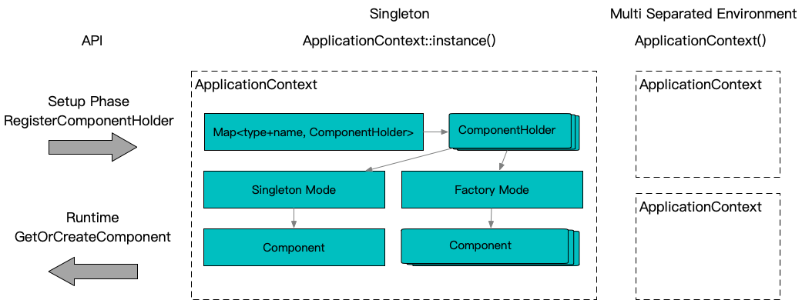

# application_context

## 原理



ApplicationContext：核心IOC容器，一般全局唯一单例模式足够；如果需要多个隔离的组件空间，可以创建多个；对外提供**注册组件**和**获取组件**两个API接口

注册组件：按照指定的名字向容器内注册某一个类型的组件，一个组件可以同时注册一系列基类类型，组件的使用方可以通过任意一个类型来获取组件

获取组件：按照指定的名字和类型向容器获取一个组件，组件可以用过**单例模式**共享引用，也可以通过**工厂模式**创建独立实例。**组件创建**由组件自身完成对使用方透明，以此来实现IOC模式


组件创建：组件实例在创建时可以通过ApplicationContext进一步获取自身依赖的组件，触发一次新的获取过程，持续递归直到一个依赖子树彻底完成。组件的创建和依赖通过**静态反射**方式实现

静态反射：目标组件类型不需要具备框架预设的基类，而是通过类型是否具备**协议函数**来实现定制，定制创建过程有两个协议机制分别是**初始化**和**自动装配**

初始化：初始化通过协议函数**initialize**成员函数来定制，支持4种函数签名，传入的ApplicationContext可以用于进一步寻址依赖，Any用于获取获取自身初始化所需的配置信息，返回==0表示成功
```c++
int initialize(ApplicationContext&, const Any&);
int initialize(ApplicationContext&);
int initialize(const Any&);
int initialize();
```

自动装配：对于无需配置动态调整的依赖，可以简化使用自动装配宏`BABYLON_AUTOWIRE`来声明式来实现
```c++
class T {
  ...
  BABYLON_AUTOWIRE(
    BABYLON_MEMBER(DependType, _member1, "component name1")
    BABYLON_MEMBER(DependType, _member2, "component name2")
  )
};
```

## 使用方法

### 实现组件

```c++
#include "babylon/application_context.h"
 
using ::babylon::ApplicationContext;

// 实现一个组件
class SomeComponent : public SomeBase, public SomeOtherBase { // 不要求继承任何基类
  ... // 任意代码

  // 【可选】定义初始化函数
  // 用来实现根据配置初始化自身
  // 以及通过编程的方式进行依赖组装
  int initialize(ApplicationContext& context, const Any& option) {
    // 通过名字和类型获取其他组件
    auto other_component_pointer = context.get<OtherComponentType>("OtherComponentName");
    // 获取配置，实际生产环境可以是yaml等
    auto config_pointer = option.get<SomeConfigType>();
    ... // 更多初始化动作
  }

  // 【可选】声明依赖自动装配
  // 在同时定义了初始化函数的情况下，会首先执行自动装配
  BABYLON_AUTOWIRE(
    // 定义一个成员
    // ApplicationContext::ScopedComponent<OtherComponentType> _member_name;
    // 并如下进行装配
    // _member_name = context.get_or_create<OtherComponentType>("OtherComponentName");
    BABYLON_MEMBER(OtherComponentType, _member_name, "OtherComponentName")
    ... // 更多自动装配
  )
};
 
// 使用宏注册组件到单例ApplicationContext
BABYLON_REGISTER_COMPONENT(SomeComponent);                      // 按单一类型注册
BABYLON_REGISTER_COMPONENT(SomeComponent, "SomeComponentName"); // 带名字注册
BABYLON_REGISTER_COMPONENT(SomeComponent, "SomeComponentName", SomeBase, SomeOtherBase, ...); // 支持按照一系列基类使用

// 注册并设置单一工厂模式，和普通注册模式的区别是禁用了单例使用模式
BABYLON_REGISTER_FACTORY_COMPONENT(SomeComponent);                      // 按单一类型注册
BABYLON_REGISTER_FACTORY_COMPONENT(SomeComponent, "SomeComponentName"); // 带名字注册
BABYLON_REGISTER_FACTORY_COMPONENT(SomeComponent, "SomeComponentName", SomeBase, SomeOtherBase, ...); // 支持按照一系列基类使用

// 也可以在程序启动期间动态编程注册
ApplicationContext::instance().register_component(
  ApplicationContext::DefaultComponentHolder<SomeComponent, SomeBase>::create(),
  "SomeComponentName");
```

### 获取组件

```c++
#include "babylon/application_context.h"
 
using ::babylon::ApplicationContext;

// 单例模式，返回SomeComponent*
// 不存在或初始化失败都会返回nullptr
instance = ApplicationContext::instance().get<SomeComponent>(); // 如果整个ApplicationContext中只有一个此类型的组件，可以如此使用
instance = ApplicationContext::instance().get<SomeComponent>("SomeComponentName"); // 有多个同类型组件时通过名字区分

// 工厂模式，返回ApplicationContext::ScopedComponent<ScopedComponent>
// 实质是一个std::unique_ptr，但是特化了deleter
// 不存在或初始化失败都会返回空
instance = ApplicationContext::instance().create<SomeComponent>();
instance = ApplicationContext::instance().create<SomeComponent>("SomeComponentName");

// 兼容模式，返回ApplicationContext::ScopedComponent<ScopedComponent>
// 优先尝试单例模式，在禁用单例模式情况下使用工厂模式
// 不存在或初始化失败都会返回空
instance = ApplicationContext::instance().get_or_create<SomeComponent>();
instance = ApplicationContext::instance().get_or_create<SomeComponent>("SomeComponentName");

// 更说明见注释
// 单测test/test_application_context.cpp
```
