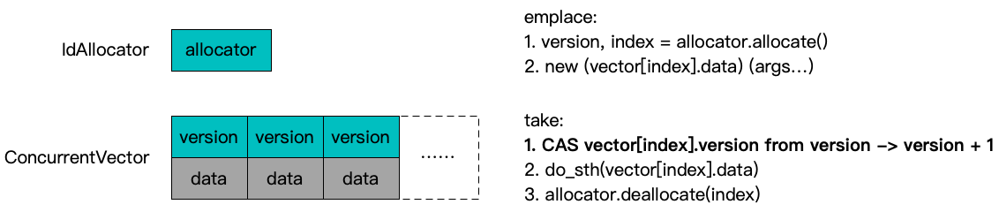

**[[English]](deposit_box.en.md)**

# deposit_box

## 原理

有时我们需要一种多个调用者动态竞争完成相同一段逻辑的设计模式，典型类似实现timeout动作（一个有效，一个无效）或者backup request动作（两个有效，先到先得）；从原理上，这种模式需要的机制和[std::call_once](https://zh.cppreference.com/w/cpp/thread/call_once)非常类似，但是会有以下几个不同点：
- 后来者并不需要等待执行者完成，单纯放弃自己的运行即可；
- 由于后来者原理上不需要任何执行动作和结果，执行者可以更早释放资源进行复用，相应地后来者需要确保不会修改可能已经被复用的资源；



采用[IdAllocator](id_allocator.zh-cn.md)和[ConcurrentVector](vector.zh-cn.md)组织实际的数据，实现聚集存储和基于序号的快速访问；每一个轮次中的take动作通过对版本号的CAS自增实现归属权竞争，后来者除CAS动作外不碰触数据部分；版本号自身同样存储在[ConcurrentVector](vector.zh-cn.md)的槽位内部，确保后来者的CAS动作本身合法，而版本号本身的单调递增特性排除了后来者的ABA问题；

## 用法示例

### DepositBox

```c++
#include <babylon/concurrent/deposit_box.h>

using ::babylon::DepositBox;

// 仅支持通过全局单例使用
auto& box = DepositBox<Item>::instance();

// 分配一个槽位，并在其中通过Item(...)构造元素，返回id用于未来竞争取回这个元素
// 并发的多个emplace动作是线程安全的
auto id = box.emplace(...);

{
  // 取回操作可以对同一个id竞争执行，是线程安全的
  auto accessor = box.take(id);
  // 通过accessor是否非空可以判定是否是第一个获取到所有权的访问者
  // 非空accessor可以进一步用于访问元素
  if (accessor) {
    accessor->item_member_function(...);
    some_function_use_item(*accessor);
  }
} // accessor析构时释放槽位，元素指针不再可用

///////////////////////////// 高级用法 /////////////////////////////////////

// 非RAII模式，直接返回元素指针Item*
auto item = box.take_released(id);
if (item) {
  item->item_member_function(...);
  some_function_use_item(*item);
}
// 不再需要访问Item*时需要主动释放所有权
box.finish_released(id);

// 不校验和操作版本号部分，直接取得id对应槽位内的元素指针，因此不能和take动作安全并发
// 在一些不能通过构造函数就完成元素准备的场景，可以在分配槽位后进一步增量操作元素
// 但是需要使用者确保此时id还未交给竞争访问者执行take动作
auto item = box.unsafe_get(id);
item->item_member_function(...);
some_function_use_item(*item);
```
