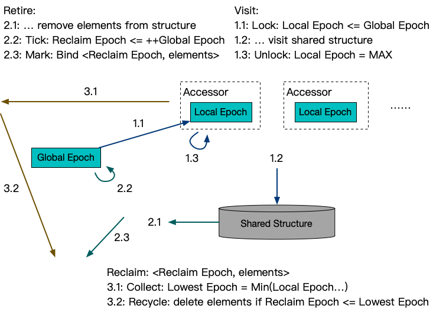

**[[English]](epoch.en.md)**

# epoch

## 原理

对于典型的无锁结构实现，一般有两方面的问题需要解决
- 在实现上缩短每个并发访问动作的临界区，收敛表达成一个CAS或者FAA动作，并最终借助硬件原子指令实现无锁协同访问；如何实现这点往往和目标数据结构和应用场景直接相关，一般无锁算法重点描述的都是这方面的实现；
- 由于不再存在可编程的多指令临界区，在『移除』动作的实现时，尽管可以保证并发的访问可以正确完整地得到『之前』或者『之后』的元素，但对于移除后的元素是否『仍被持有』无法进行跟踪，也就无法确认『何时能够释放』；大多无锁算法描述会在此时假设一个外部环境已经实现了无用元素的自动识别和释放，也就是自动垃圾回收；

无锁算法的垃圾回收和数据结构和应用场景关联较弱，一般会被单独作为一个课题考虑，例如[Performance of memory reclamation for lockless synchronization](https://sysweb.cs.toronto.edu/publication_files/0000/0159/jpdc07.pdf)这篇文章对于一些典型的无锁回收进行了综述评价；其中提到了典型的几个回收方案QSBR(Quiescent-state-based reclamation)、EBR(Epoch-based reclamation)、HPBR(Hazard-pointer-based reclamation)

Epoch是EBR机制的一个修改版实现，核心是通过分拆访问、淘汰和回收动作降低机制引起的额外开销，主要区别点有
- 从经典的三个epoch循环，改为无限自增，支持异步回收
- 不涉及淘汰的访问不再推进epoch，减少一次内存屏障的开销
- 访问、淘汰和回收动作都支持聚合执行，进一步减少内存屏障的开销



## 用法示例

```c++
#include "babylon/concurrent/epoch.h"

using ::babylon::Epoch;

// 定义一个Epoch实例
Epoch epoch;

// 访问共享结构之前使用Epoch开启一个线程局部的临界区
{
  std::lock_guard<Epoch> lock {epoch};
  ... // 临界区内部可以访问共享结构的元素
} // 临界区结束后，得到的元素指针就不再能被使用了

// 除了线程局部模式，也可以主动创建Accessor跟踪临界区
auto accessor = epoch.create_accessor();
{
  std::lock_guard<Accessor> lock {accessor};
  ... // 临界区内部可以访问共享结构的元素
} // 临界区结束后，得到的元素指针就不再能被使用了

{
  accessor.lock();
  Task task {::std::move(accessor), ...} // 可以通过移动accessor转移临界区
  ... // 可以跟随task转移到异步线程等，再最终accessor.unlock()后结束临界区
} // 转移走的话，临界区就不会在此结束了

// 淘汰操作
... // 操作共享结构，摘除一些元素
// 推进epoch，返回之前摘除元素可被回收的最小epoch
auto lowest_epoch = epoch.tick();

// lowest_epoch和摘除的元素绑定，后续可以同步或者异步检测进行真正的回收
auto low_water_mark = epoch.low_water_mark();
// 当low_water_mark超过lowest_epoch后，元素即可以安全回收
if (lowest_epoch <= low_water_mark) {
  ... // 可以回收lowest_epoch对应的元素
}
```
