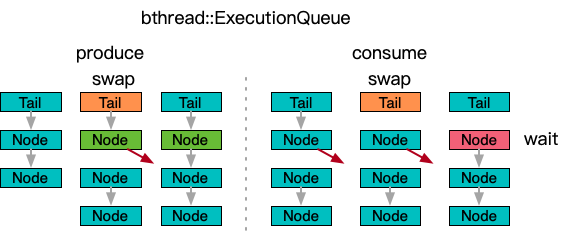

**[[English]](execution_queue.en.md)**

# execution_queue

## 原理

包装[ConcurrentBoundedQueue](bounded_queue.zh-cn.md)，实现按需激活MPSC消费者的模式
- 每次生产数据时对待处理计数器原子自增，如果自增前为0，边沿触发，启动消费者线程
- 消费者线程持续消费数据，当无数据可消费时，将计数器值和0交换
- 如果交换得到的值和最近一次消费前记录的值无变化，退出消费者线程
- 否则，进入下一轮消费循环

主要用于支持大量低活队列的情况，节省不活跃的监听消费线程，功能和[bthread::ExecutionQueue](https://github.com/apache/brpc/blob/master/docs/cn/execution_queue.md)类似，但是
- 消费者通过[Executor](../executor.zh-cn.md)接口提交，支持使用自定义线程/协程机制
- 保持生产者wait-free提交的同时，不会在竞争时引起消费者阻塞



## 用法示例

```c++
#include "babylon/concurrent/execution_queue.h"

using ::babylon::ConcurrentExecutionQueue;

// 显式定义一个队列
using Queue = ConcurrentExecutionQueue<T>;
Queue queue;

// 设置队列容量到N
// 消费者采用some_executor执行
// 注册lambda消费函数
queue.initialize(N, some_executor, [] (Queue::Iterator iter, Queue::Iterator end) {
  // 消费区间的数据
  while (iter != end) {
    T& item = *iter;
    do_sth_with(item);
    ++iter;
  }
});

// 生产一个数据，并按需启动后台消费
queue.execute("10086");
...

// 等待当前发布数据全部消费完成
// 注意不包含stop语义，可以反复execute & join
queue.join();
```
