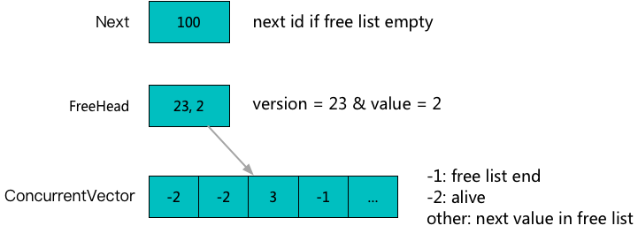

**[[English]](id_allocator.en.md)**

# id_allocator

## 原理

用于为一类资源的每个实例，分配一个唯一，且取值尽量集中于[0, 实例总量)的数字标识，类似于Unix的File Descriptor概念；同时为了解决创建销毁时复用带来的ABA问题，附加了版本号机制；主要用于加速一些资源管理操作

例如在需要对资源记录附加信息的场景中（例如为socket附加链接状态信息等），基于数字标识的连续性，可以使用数组而非hash等方式来寻址，提高时间和空间效率

实现上，采用LockFree栈的方式来组织空闲标识，结合一个原子变量来组成



## 用法示例

### IdAllocator

```c++
#include <babylon/concurrent/id_allocator.h>

using ::babylon::IdAllocator;

// 定义一个分配器，支持32位和16位两个版本，16位版本主要用于支持thread id的实现（合理程序的的thread不太可能同时使用65536个以上）
IdAllocator<uint32_t> allocator;
IdAllocator<uint16_t> allocator;

// 分配一个id，确保id值在当前所有已分配未释放的集合中唯一；确保version + id在可见程序竞争范围内唯一
auto versioned_value = allocator.allocate();
// versioned_value.value = 分配的id值
// versioned_value.version = 分配的版本

// 释放一个id
allocator.deallocate(versioned_value);
// 单独传入id值也可以，因为可以保证已分配集合中唯一，实际释放接口不使用version部分
allocator.deallocate(VersionedValue<T>{value});

// 获得已分配的id上限，[0, end_id)范围内为曾经分配过的id值范围
// 可以以此进行遍历类型的操作
auto end_value = allocator.end();

// 遍历当前已分配未释放的id
allocator.for_each([] (uint32_t begin, uint32_t end) {
    // [begin, end)表示一个活跃id的区间
    // 一次for_each会多次调用这个callback，每次送入一个非空区间
});
```

### ThreadId

利用babylon::IdAllocator为每个线程分配一个唯一id，具备的babylon::IdAllocator的尽量小尽量连续的特点

```c++
#include <babylon/concurrent/id_allocator.h>

using ::babylon::ThreadId;

// 获得当前线程的id，当有线程退出后，其使用的id会被后续新线程使用
VersionedValue<uint16_t> thread_id = ThreadId::current_thread_id();

// 获得曾经活跃过的线程id上限，[0, end_id)区间内为曾经活跃过的id区间
// 曾经活跃的定义为调用过ThreadId::current_thread_id
// 但是当前可能还在运行，也可能已经退出
uint16_t end_id = ThreadId::end();

// 遍历当前活跃线程id，活跃定义为
// 调用过ThreadId::current_thread_id&未退出
ThreadId::for_each([] (uint16_t begin, uint16_t end) {
    // [begin, end)表示一个活跃线程id的区间
    // 一次for_each会多次调用这个callback，每次送入一个非空区间
});
```
