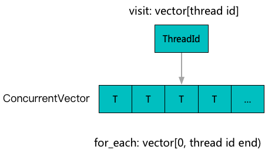
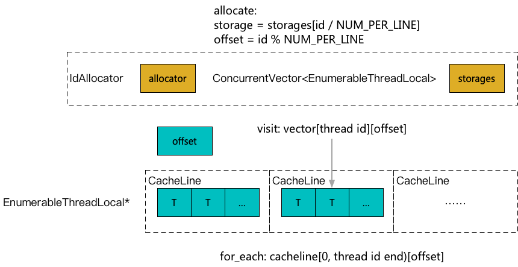

**[[简体中文]](thread_local.zh-cn.md)**

# Thread Local Storage

## Principle

Thread Local Storage (TLS) mechanisms are often used as caches to accelerate high-concurrency operations. POSIX and compilers provide corresponding support, but each has its limitations:

1. The `pthread_key_create` mechanism is flexible but has a strict maximum limit, which can be restrictive in scenarios requiring a large number of TLS instances for acceleration.
2. Although the total number of `thread_local` instances is not limited, it must be determinable at compile time, which is not suitable for scenarios needing a dynamic number of TLS instances.
3. Both mechanisms lack traversal functionality, making them unsuitable for certain application scenarios.

To address these issues, `EnumerableThreadLocal` implements a TLS mechanism at the application level using `vector` and `id_allocator`. It mainly provides the ability to create an arbitrary number of instances dynamically and allows for efficient traversal.

### EnumerableThreadLocal



### CompactEnumerableThreadLocal



To efficiently implement TLS, it is often necessary to isolate data between threads by Cache Line. For a large number of small TLS instances (e.g., a `size_t` counter), this can lead to significant waste. `CompactEnumerableThreadLocal` reduces this waste by packing multiple small TLS instances together to share a single Cache Line.

## Usage Example

### EnumerableThreadLocal

```c++
#include <babylon/concurrent/thread_local.h>

using ::babylon::EnumerableThreadLocal;

// Define a type aggregator
EnumerableThreadLocal<size_t> storage;
// By default, there is no cache line isolation; you can implement it manually if needed
EnumerableThreadLocal<Aligned<size_t, 64>> storage;

// Get local data
// Thread 1
size_t& local_value = storage.local();
local_value = 3;

// Thread 2
size_t& local_value = storage.local();
local_value = 4;

// Aggregate all local data
size_t sum = 0;
storage.for_each([&] (size_t* begin, size_t* end) {
    while (begin != end) {
        sum += *begin++;
    }
});
// sum = 7

// When Thread 2 exits
// Aggregate all local data again
size_t sum_all = 0;
size_t sum_alive = 0;
storage.for_each([&] (size_t* begin, size_t* end) {
    while (begin != end) {
        sum_all += *begin++;
    }
});
storage.for_each_alive([&] (size_t* begin, size_t* end) {
    while (begin != end) {
        sum_alive += *begin++;
    }
});
// sum_all = 7, sum_alive = 3
```

### CompactEnumerableThreadLocal

```c++
#include <babylon/concurrent/thread_local.h>

using ::babylon::CompactEnumerableThreadLocal;

// Define a type aggregator
// The template parameter specifies how many cache lines a block contains; in scenarios where many instances need to be created,
// More cache lines will make memory more compact and speed up dense traversal
CompactEnumerableThreadLocal<size_t, 1> storage;

// Get local data
// Thread 1
size_t& local_value = storage.local();
local_value = 3;

// Thread 2
size_t& local_value = storage.local();
local_value = 4;

// Aggregate all local data
size_t sum = 0;
storage.for_each([&] (size_t& value) {
    sum += value;
});
// sum = 7
```
