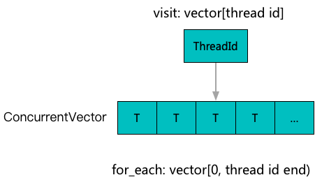
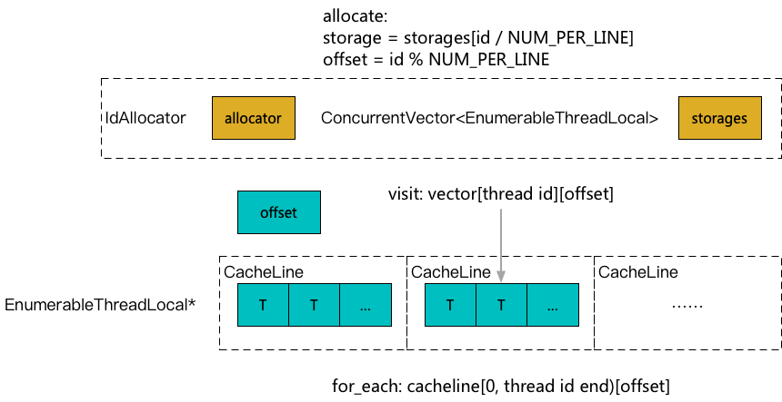

**[[English]](thread_local.en.md)**

# thread_local

## 原理

线程局部存储（Thread Local Storage）机制常被用作缓存来加速一些高并发操作，posix和编译器也都提供了相应的支持，但又都有各自的局限性

1. pthread_key_create相关机制比较灵活，但是存在一个限定比较严格的最大上限，对于需要大量TLS加速的场景限制较多
2. thread_local总量虽然不受限制，但是必须在编译期可以确定，对于需要动态个数TLS加速的场景无法支持
3. 共性上，两者都未提供遍历功能，对于一些应用场景无法支持

为了解决这些问题，EnumerableThreadLocal在应用层基于vector和id_allocator实现了一套TLS机制，主要提供灵活任意数量动态创建以及可以高效遍历的能力

### EnumerableThreadLocal



### CompactEnumerableThreadLocal



为了高效实现TLS，各个线程的数据之间往往需要做Cache Line隔离，对于大量小尺寸的TLS实例（例如一个size_t的统计量）会产生较多浪费；CompactEnumerableThreadLocal通过将多个小尺寸TLS打包到一起，共享一条Cache Line来降低这种浪费

## 用法示例

### EnumerableThreadLocal

```c++
#include <babylon/concurrent/thread_local.h>

using ::babylon::EnumerableThreadLocal;

// 定义一个类型聚合器
EnumerableThreadLocal<size_t> storage;
// 默认不进行cacheline隔离，如果需要可以自行完成
EnumerableThreadLocal<Aligned<size_t, 64>> storage;

// 获得本地数据
// 线程1
size_t& local_value = storage.local();
local_value = 3;

// 线程2
size_t& local_value = storage.local();
local_value = 4;

// 汇聚所有本地数据
size_t sum = 0;
storage.for_each([&] (size_t* begin, size_t* end) {
    while (begin != end) {
        sum += *begin++;
    }
});
// sum = 7

// 线程2退出
// 汇聚所有本地数据
size_t sum_all = 0;
size_t sum_alive = 0;
storage.for_each([&] (size_t* begin, size_t* end) {
    while (begin != end) {
        sum_all += *begin++;
    }
});
storage.for_each_alive([&] (size_t* begin, size_t* end) {
    while (begin != end) {
        sum_alive += *begin++;
    }
});
// sum_all = 7, sum_alive = 3
```

### CompactEnumerableThreadLocal

```c++
#include <babylon/concurrent/thread_local.h>

using ::babylon::CompactEnumerableThreadLocal;

// 定义一个类型聚合器
// 模板参数指定一个聚合块包含了多少cacheline，在需要创建很多实例的情况下
// 更多的cacheline会让内存更紧凑，加快密集遍历的速度
CompactEnumerableThreadLocal<size_t, 1> storage;

// 获得本地数据
// 线程1
size_t& local_value = storage.local();
local_value = 3;

// 线程2
size_t& local_value = storage.local();
local_value = 4;

// 汇聚所有本地数据
size_t sum = 0;
storage.for_each([&] (size_t& value) {
    sum += value;
});
// sum = 7
```
