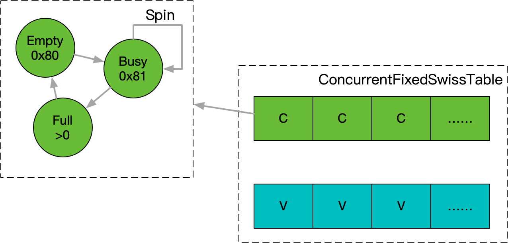

**[[简体中文]](transient_hash_table.zh-cn.md)**

# Transient Hash Table

## Principle

`ConcurrentFixedSwissTable` is based on Google's SwissTable, utilizing control bytes to implement fine-grained spinlocks at the slot level, specifically designed for high-concurrency lookup and insertion operations. However, it lacks support for deletion and automatic rehashing.

`ConcurrentTransientHashSet` and `ConcurrentTransientHashMap` build upon `ConcurrentFixedSwissTable`, using a simple lock-and-copy mechanism to provide automatic rehashing capabilities, enhancing their practicality. As indicated by their names, these structures do not support deletion and are intended for short-lived concurrent constructions and lookups, making it easy to clear them when no longer needed.



## Usage Example

```c++
#include <babylon/concurrent/transient_hash_table.h>

using ::babylon::ConcurrentTransientHashSet;
using ::babylon::ConcurrentTransientHashMap;

// The default initial capacity is very small (16 or 32). For single-use, specify an appropriate size based on the scenario.
// For repeated use, `clear` will retain the previous capacity.
ConcurrentTransientHashSet<::std::string> set;
ConcurrentTransientHashSet<::std::string> set(1024);
ConcurrentTransientHashMap<::std::string, ::std::string> map;
ConcurrentTransientHashMap<::std::string, ::std::string> map(1024);

// Lookup and insertion are thread-safe
set.emplace("10086");
map.emplace("10086", "10010");
set.find("10086"); // != set.end();
map.find("10086"); // != map.end();

// Traversal is possible
for (auto& value : set) {
    // value == "10086"
}
for (auto& pair : map) {
    // pair.first == "10086"
    // pair.second == "10010"
}

// Clear for the next reuse
set.clear();
map.clear();
```

## Performance Evaluation

The benchmark code can be found in `bench/bench_concurrent_hash_table.cpp`. It randomly generates 1 million `uint64_t` data, forming a specified duplication rate and evenly distributing it among multiple threads for concurrent insertion. It evaluates the number of operations per second (single-threaded) and CPU usage per 1,000 operations. The performance of several typical open-source concurrent hash tables is compared in pure concurrent insertion scenarios, including TBB, Folly, and highly-rated personal libraries such as `parallel-hashmap` and `libcuckoo`.

### Performance Table (Hit Ratio = 0.01)

| Threads                             | 1                  | 4            | 16            | 1                  | 4            |       | 16            |       |
|-------------------------------------|--------------------|--------------|---------------|--------------------|--------------|-------|---------------|-------|
|                                     | QPS                | QPS          | QPS           | QPS                | QPS          | CPU   | QPS           | CPU   |
| `tbb::concurrent_unordered_set`     | 2136               | 2923 (730)   | 4065 (254)    | 1760               | 2380 (595)   | 1.096 | 4651 (290)    | 1.33  |
| `tbb::concurrent_hash_set`          | 5154               | 4255 (1063)  | 4807 (300)    | 5181               | 3546 (221)   | 0.828 | 4566 (285)    | 2.03  |
| `phmap::parallel_flat_hash_set`     | 27855              | 14224 (3556) | 14814 (925)   | 18148              | 12870 (3217) | 0.294 | 15455 (965)   | 0.961 |
| `folly::ConcurrentHashMap`          | 4310               | 10952 (2738) | 34129 (2133)  | 4132               | 11723 (2930) | 0.124 | 36231 (2264)  | 0.049 |
| `libcuckoo::cuckoohash_map`         | 4424               | 8928 (2232)  | 31746 (1984)  | 5263               | 14792 (3698) | 0.223 | 55248 (3453)  | 0.166 |
| `folly::AtomicUnorderedInsertMap`   | 5847               | 9090 (2272)  | 29673 (1854)  | 10460              | 29761 (7440) | 0.095 | 62111 (3881)  | 0.116 |
| `folly::AtomicHashMap`              | 7936               | 19455 (4863) | 61349 (3834)  | 6896               | 20366 (5091) | 0.145 | 65789 (4111)  | 0.110 |
| `babylon::ConcurrentTransientHashSet` | 24509              | 39062 (9765) | 129870 (8116) | 17825              | 36231 (9057) | 0.096 | 125944 (7871) | 0.110 |

### Performance Table (Hit Ratio = 0.5)

| Threads                             | 1                  | 4            | 16            | 1                  | 4            |       | 16            |       |
|-------------------------------------|--------------------|---------------|----------------|--------------------|---------------|-------|----------------|-------|
|                                     | QPS                | QPS          | QPS            | QPS                | QPS           | CPU   | QPS            | CPU   |
| `tbb::concurrent_unordered_set`     | 2962               | 3921 (980)    | 6711 (419)     | 2518               | 4671 (1168)   | 0.584 | 5988 (374)     | 1.42  |
| `tbb::concurrent_hash_set`          | 5882               | 6211 (1552)   | 8333 (820)     | 5847               | 6172 (1543)   | 0.506 | 8333 (520)     | 1.21  |
| `phmap::parallel_flat_hash_set`     | 32467              | 21929 (5482)  | 22172 (1385)   | 30769              | 22222 (5555)  | 0.172 | 23364 (1460)   | 0.643 |
| `folly::ConcurrentHashMap`          | 4405               | 10526 (2631)  | 33003 (2062)   | 4149               | 10752 (2688)  | 0.178 | 34482 (2155)   | 0.073 |
| `libcuckoo::cuckoohash_map`         | 5952               | 12804 (3201)  | 46511 (2906)   | 6849               | 16949 (4237)  | 0.203 | 61349 (3834)   | 0.174 |
| `folly::AtomicUnorderedInsertMap`   | 12690              | 27700 (6925)  | 54644 (3415)   | 17857              | 45248 (11312) | 0.068 | 72992 (4562)   | 0.134 |
| `folly::AtomicHashMap`              | 11025              | 27397 (6849)  | 88495 (5530)   | 11198              | 30769 (7692)  | 0.102 | 99009 (6188)   | 0.081 |
| `babylon::ConcurrentTransientHashSet` | 29239              | 49504 (12376) | 166666 (10416) | 33222              | 52910 (13227) | 0.069 | 172413 (10775) | 0.081 |

### Performance Table (Hit Ratio = 0.94)

| Threads                             | 1                  | 4              | 16             | 1                  | 4              |       | 16             |       |
|-------------------------------------|--------------------|----------------|----------------|--------------------|----------------|-------|----------------|-------|
|                                     | QPS                | QPS            | QPS            | QPS                | QPS            | CPU   | QPS            | CPU   |
| `tbb::concurrent_unordered_set`     | 7633               | 16666 (4166)   | 30211 (1888)   | 7751               | 15847 (3961)   | 0.224 | 25125 (1570)   | 0.498 |
| `tbb::concurrent_hash_set`          | 12722              | 18903 (4729)   | 43290 (2705)   | 14164              | 20120 (5030)   | 0.181 | 61728 (3858)   | 0.181 |
| `folly::ConcurrentHashMap`          | 7812               | 16447 (4111)   | 51282 (3205)   | ```markdown
| 8474               | 16806 (4201)   | 0.174 | 51282 (3205)   | 0.129 |
| `libcuckoo::cuckoohash_map`         | 10460              | 20325 (5081)   | 72992 (4562)   | 9900               | 21052 (5263)  | 0.171 | 75757 (4734)   | 0.171 |
| `folly::AtomicUnorderedInsertMap`   | 36900              | 91743 (22935)  | 85470 (5341)   | 48309              | 129198 (32299) | 0.026 | 90909 (5681)   | 0.155 |
| `phmap::parallel_flat_hash_set`     | 61349              | 80645 (20161)  | 135501 (8468)  | 79365              | 96153 (24038)  | 0.040 | 123456 (7716)  | 0.123 |
| `folly::AtomicHashMap`              | 18348              | 57471 (14367)  | 204081 (12755) | 23923              | 78740 (19685)  | 0.046 | 264550 (16534) | 0.041 |
| `babylon::ConcurrentTransientHashSet` | 59523              | 133333 (33333) | 401606 (25100) | 80645              | 173010 (43252) | 0.022 | 502512 (31407) | 0.025 |

## Overall Evaluation

1. TBB's two concurrent structures have a relatively complete interface but suffer from poor performance across the board due to their theoretical implementation. In low concurrency/high hit scenarios, `phmap`, which wraps the Swiss table with simple sharded locks, performs decently but shows significant performance degradation as concurrency increases.
2. Folly’s implementations demonstrate a high level of quality overall. The Atomic series performs well in concurrent scenarios with known sizes. Notably, `folly::ConcurrentHashMap` offers stable iterator functionality with deletion support through hazard pointers, maintaining good concurrency capabilities, making it quite versatile. CMU's `libcuckoo` provides a surprisingly good engineering implementation with concurrent performance exceeding that of Folly when deletion is not a concern.
3. In deletion-unsupported scenarios, Folly’s Atomic series performs well; however, combining the control bits of Swiss tables and separate data design, `babylon::ConcurrentTransientHashSet` supports arbitrary keys while further enhancing throughput.
```
