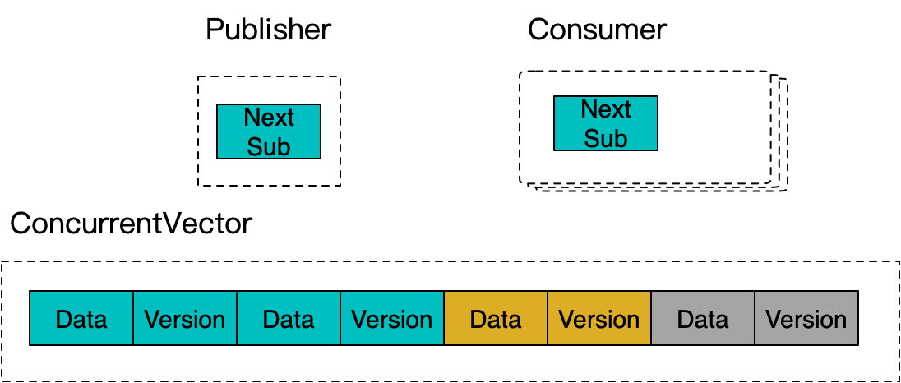

**[[English]](transient_topic.en.md)**

# transient_topic

## 原理

在连续空间上实现的MPSC Pub-Sub Topic，消费侧不支持多线程竞争，但是可以支持多个消费者独立重复订阅一次；和典型Pub-Sub Topic的核心区别是致力于实现『瞬时』的支持，即预期被周期性地使用，每一个使用周期内，发布总量有限的数据，并在下一个周期到来前整体清空；例如典型可以支持一次RPC内部实现局部的『瞬时』Pub-Sub并行计算；

实现上采用vector存储已发布数据，并通过类似bounded_queue的分槽位版本的机制来进行发布和消费的协同



## 用法示例

```c++
#include <babylon/concurrent/transient_topic.h>

using ::babylon::ConcurrentTransientTopic;

// 显式定义一个Topic
ConcurrentTransientTopic<::std::string> topic;

// 预留N长度的空间
// 在反复使用同一个topic实例的情况会保留之前的空间
// 因此一般无需特意reserve
topic.reserve(N);

// 发布数据，线程安全
threads:
    topic.publish(V);  // 单个发布
    // 批量发布
    topic.publish_n(N, [] (Iter begin, Iter end) {
        ... // 填充[begin, end)内的待发布结果，返回后正式发布
            // 可能会被调用多次，每次送入一个子区间，最终总量达到N
    });

// 结束发布，之后消费者会感知到结束，并结束消费循环
topic.close();

// 创建消费者
// 多次创建可以获得多个独立的消费者，各自可以消费一遍全量数据
auto consumer = topic.subscribe();

// 消费1个元素，直接返回元素指针，暂无发布时会阻塞等待
// 完成消费后返回nullptr
auto item = consumer.consume();

// 批量消费num个，返回可消费区间，暂无足量发布时会阻塞等待
// 除非queue提前close，此时返回的range不足num个
auto range = consumer.consume(num);
for (size_t i = 0; i < range.size(); ++i) {
	auto& item = range[i] // 获取本批量中第i个元素引用
}

// 清理队列用于下一次发布重用
topic.clear();
```
