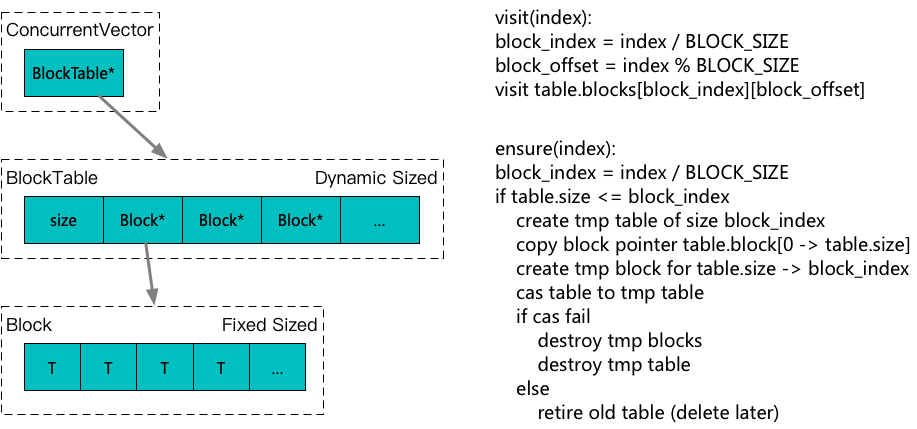

**[[English]](vector.en.md)**

# vector

## 原理

基于分段数组提供接近std::vector的随机访问性能，以及线程安全的大小增长能力，保证了已经获取到的元素地址，不会因容器后续的增长而失效；与std::vector的几个核心区别点

1. size == capacity == n * block_size，大小增长以预先指定的block size为单位批量进行
2. &v[i] + 1 != &v[i + 1]，可随机访问，但底层空间未必连续
3. 并发的v.ensure(i)的操作是线程安全的，且保证任意通过&v.ensure(i)取得的地址不会因为后续的再增长而失效
4. 访问和增长操作都是wait-free的（不考虑内存分配和元素构造内部的实现情况下）



## 用法示例

```c++
#include <babylon/concurrent/vector.h>

using ::babylon::ConcurrentVector;

// 静态block_size
ConcurrentVector<std::string, 128> vector;					// 静态指定block_size为128，必须为2^n

// 动态block_size
ConcurrentVector<std::string> vector;						// ConcurrentVector<std::string, 0>(1024)
ConcurrentVector<std::string, 0> vector;					// ConcurrentVector<std::string, 0>(1024)，0表示动态block_size，默认
ConcurrentVector<std::string, 0> vector(block_size_hint);	// 实际block_size会将block_size_hint向上取整到2^n

// 扩展容量
vector.reserve(10010);					// 确保size增长到至少容纳10010个元素

// 可能扩展容量的随机访问
vector.ensure(10086).assign("10086"); 	// 如果当前大小不足以容纳10010号元素，则先扩展底层存储大小，然后返回10086号元素引用

// 不会检测容量的随机访问，一般用在已经明确了index < size的情况下
vector[10086].assign("10086"); 			// 如果当前大小不足以容纳10086号元素，可能会发生越界错误

// 在短期预计访问多个index的情况下，可以先取得snapshot，之后的访问可以避开重复取分段映射表
auto snapshot = vector.snapshot();
auto snapshot = vector.reserved_snapshot(30); 		// 确保[0, 30)元素可访问
for (size_t i = 0; i < 30; ++i) {
	snapshot[i] = ... // 每次访问不再重新获取分端映射表，加速访问
}

// 从类似vector的连续空间拷贝
// 类似std::copy_n，针对底层分段连续做了优化
vector.copy_n(iter, size, offset);
// 更说明见注释
// 单测test/test_concurrent_vector.cpp
```

## 性能评测

### 顺序写

```
==================== batch 100 ====================
std::vector loop assign use 0.212214
std::vector fill use 0.211325
babylon::ConcurrentVector loop assign use 1.26182
babylon::ConcurrentVector snapshot loop assign use 1.05421
babylon::ConcurrentVector fill use 0.219594
==================== batch 10000 ====================
std::vector loop assign use 0.288137
std::vector fill use 0.281818
babylon::ConcurrentVector loop assign use 1.18824
babylon::ConcurrentVector snapshot loop assign use 0.965977
babylon::ConcurrentVector fill use 0.304165
```

### 顺序读

```
==================== batch 100 ====================
std::vector loop read use 0.255723
babylon::ConcurrentVector loop read use 1.36107
babylon::ConcurrentVector snapshot loop read use 1.06447
==================== batch 10000 ====================
std::vector loop read use 0.27499
babylon::ConcurrentVector loop read use 1.22806
babylon::ConcurrentVector snapshot loop read use 0.952212
```

### 12并发读写

```
==================== seq_cst rw batch 2 ====================
std::vector use 0.342871
std::vector aligned use 0.0452792
babylon::ConcurrentVector ensure use 0.463758
babylon::ConcurrentVector [] use 0.357992
babylon::ConcurrentVector snapshot [] use 0.419337
babylon::ConcurrentVector aligned ensure use 0.045025
babylon::ConcurrentVector aligned [] use 0.047975
babylon::ConcurrentVector aligned snapshot [] use 0.0898667
==================== seq_cst rw batch 20 ====================
std::vector use 0.0754283
std::vector aligned use 0.0624383
babylon::ConcurrentVector ensure use 0.0718946
babylon::ConcurrentVector [] use 0.0718017
babylon::ConcurrentVector snapshot [] use 0.0634408
babylon::ConcurrentVector aligned ensure use 0.0610958
babylon::ConcurrentVector aligned [] use 0.0681283
babylon::ConcurrentVector aligned snapshot [] use 0.0622529
```
