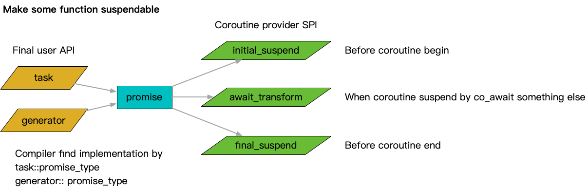
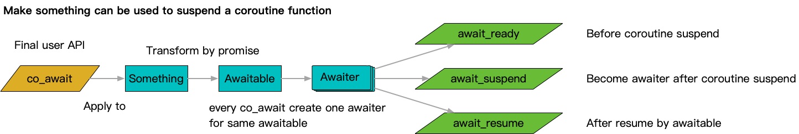

**[[English]](README.en.md)**

# coroutine

## 原理

基于[C++20](https://en.cppreference.com/w/cpp/20)的[coroutine](https://en.cppreference.com/w/cpp/language/coroutines)标准，实现的一套协程机制；按照标准，一个协程函数除了内部包含`co_xxx`关键字语句之外，返回值也有一系列特殊要求；要求整体可以分为两个大类，一类用来支持单一返回值协程，返回值一般称为task；另一类用来支持多次返回值协程，一般被称为generator；

[coroutine](https://en.cppreference.com/w/cpp/language/coroutines)标准并非直接定义了协程机制，而是更为抽象地统一了协程机制的API部分，并将细粒度的SPI部分分离到用户不可见的部分；最终通过用户 -> API -> 编译器 -> SPI -> 协程机制来进行运转；整体工作模式为
- 最终用户通过统一关键字操作符表达语义，例如`co_await`和`co_return`
- 最终用户通过协程函数返回类型，表达实际对接的协程机制
- 编译器按照操作符语义，按标准分阶段完成协程的中断和恢复
- 编译器在中断和恢复前后的若干标准点位，调用实际协程提供框架的相应功能

## 子模块文档

- [task](task.zh-cn.md)
- [future_awaitable](future_awaitable.zh-cn.md)
- [cancellable](cancellable.zh-cn.md)
- [futex](futex.zh-cn.md)
