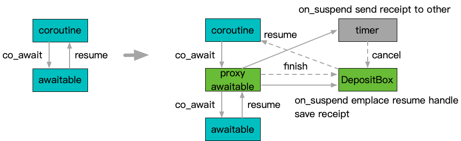

**[[English]](cancellable.en.md)**

# cancellable

## 原理

标准[coroutine](https://en.cppreference.com/w/cpp/language/coroutines)机制中的`co_await`相当于[std::future::get](https://en.cppreference.com/w/cpp/thread/future/get)方法，即等待目标awaitable完成，并在之后才能恢复执行；但有时需要让等待具备提前结束的能力，最为典型的场景是timeout这类场景；



实现上Cancellable包装一个常规的awaitable，并通过插入一个proxy awaitable实现取消支持；一方面proxy awaitable传递`co_await`到包装的awaitable，并最终传导恢复执行动作到发起`co_await`的原始协程；另一方面，proxy awaitable并不将待恢复的协程句柄存在本地，而是存放到[DepositBox](../concurrent/deposit_box.md)中，并同时传输给注册的timer等执行取消动作的触发源；当包装的awaitable发起恢复，或者取消触发源发起取消时，会竞争[DepositBox](../concurrent/deposit_box.md)中存放的协程句柄，并由胜出方执行恢复动作；

## 用法示例

```c++
#include "babylon/coroutine/task.h"
#include "babylon/coroutine/cancellable.h"

using ::babylon::coroutine::Task;
using ::babylon::coroutine::Cancellable;

using Cancellation = typename Cancellable<A>::Cancellation;

Task<...> some_coroutine(...) {
  ...
  // 包装原始awaitable称为Cancellable
  auto optional_value = co_await Cancellable<A>(::std::move(a)).on_suspend(
    // 通过回调函数在协程挂起后接收相应的取消句柄
    [&](Cancellation cancel) {
      // 典型操作是把cancel句柄注册到某种timer机制，并在指定时间后调用cancel()发起取消
      // 从回调被执行开始，cancel就可用了，甚至在回调内部也可以直接发起cancel()，虽然一般这并没有什么意义
      on_timer(cancel, 100ms);
    }
  );
  // 如果a先完成，则返回非空值可供操作
  if (optional_value) {
    optional_value->item_member_function(...);
    some_function_use_item(*optional_value);
  } else {
    // 收到空值表示取消动作先一步发起
  } 
  ...
}
```
