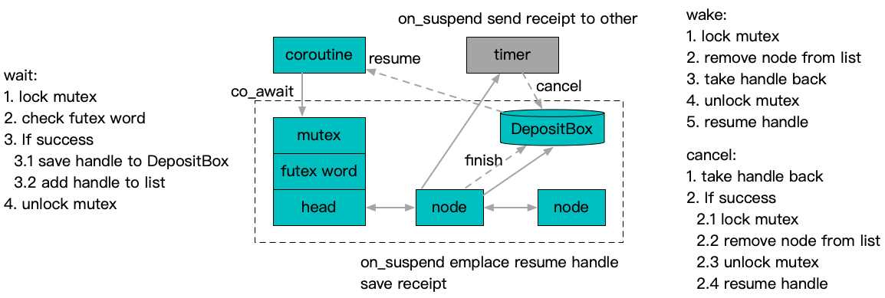

**[[简体中文]](futex.zh-cn.md)**

# Futex

## Principle

The standard [coroutine](https://en.cppreference.com/w/cpp/language/coroutines) mechanism's `co_await` is essentially aligned with the [std::future](https://en.cppreference.com/w/cpp/thread/future) parallel synchronization model. However, more complex synchronization models, such as [std::mutex](https://en.cppreference.com/w/cpp/thread/mutex) or [std::condition_variable](https://en.cppreference.com/w/cpp/thread/condition_variable), can be unified through a mechanism similar to [futex(2)](https://man7.org/linux/man-pages/man2/futex.2.html).



The implementation uses a `std::mutex` for each futex instance to manage value checks and to chain together waiting callbacks atomically. The [DepositBox](../concurrent/deposit_box.en.md) is used to ensure the uniqueness of cancellation and wake-up actions.

## Usage Example

```c++
#include "babylon/coroutine/task.h"
#include "babylon/coroutine/futex.h"

using ::babylon::coroutine::Task;
using ::babylon::coroutine::Futex;

using Cancellation = Futex::Cancellation;

// Futex is initialized with an internal value of 0
Futex futex;

// Read and write futex internal value
futex.value() = ...;
// Atomically read and write futex internal value
futex.atomic_value().xxxx(...);

Task<...> some_coroutine(...) {
  ...
  // Atomically check if the internal value is equal to expected_value.
  // If true, suspend the coroutine, otherwise continue execution.
  co_await futex.wait(expected_value).on_suspend(
    // Use a callback function to receive the cancellation handle after the coroutine is suspended.
    // Note that if the coroutine is not suspended, the callback won't be called.
    [&](Cancellation cancel) {
      // Typically, the cancel handle is registered to a timer mechanism, and after a specified time, cancel() is invoked to trigger cancellation.
      // From the moment the callback is executed, cancel is usable. You can even invoke cancel() directly within the callback, though it's generally unnecessary.
      on_timer(cancel, 100ms);
    }
  );
  // Several scenarios could lead to execution reaching this point:
  // 1. The expected_value was not met.
  // 2. After suspension, futex.wake_one or futex.wake_all was called.
  // 3. After suspension, cancel() was invoked.
  ...
}
```
