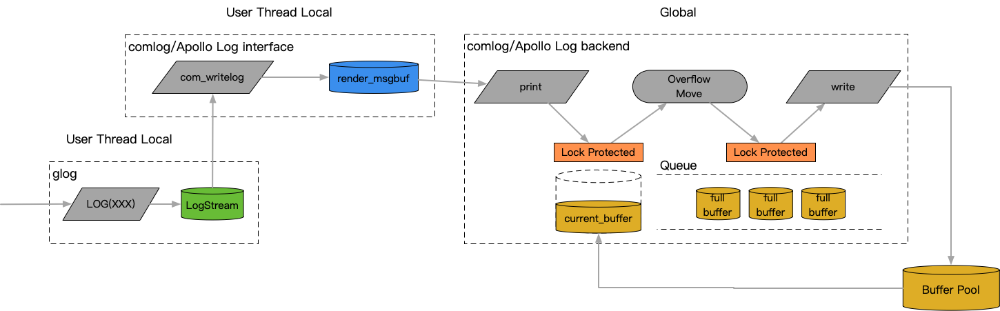
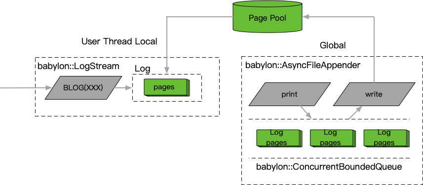

# logging

## 原理

目前后端服务在glog的带动下，类streaming的<<接口模式被广泛采用，在此基础上结合sink扩展成为异步方案基本成为标准。百度后端之前内部使用的comlog系统，车载的apollo都使用了类似的模式。在常规场景下一般功能已经足够，不过如果追求最佳性能的话，这个常用组合还是存在一些问题



1. 从用户<<接入开始，到writev系统调用间，一共存在3次日志内容的拷贝

- 原始信息>>streambuf
- streambuf->render_msgbuf
- render_msgbuf->current_buffer

2. 对于全局结构采用锁保护，例如current_buffer为锁后拷贝，在并发增大情况下竞争问题会逐步显现

针对这两个问题，采用ConcurrentBoundedQueue实现babylon::AsyncFileAppender，消除了锁同步的动作，同时通过babylon::PageAllocator将中转使用的3次内存拷贝降低为1次



## 使用方法

### 用法示例

```c++
#include "babylon/logging/logger.h"

using ::babylon::LoggerManager;
using ::babylon::LogSeverity;

// 取得默认logger
auto& root_logger = LoggerManager::instance().get_root_logger();

// 根据name取得某个层级的logger
// name根据层级查找配置，例如对于name = "a.b.c"
// 会依次尝试"a.b.c" -> "a.b" -> "a" -> root
auto& logger = LoggerManager::instance().get_logger("...");

// 开启一次log事务
BLOG(INFO) << ...                    // 使用root logger
BLOG_STREAM(logger, INFO) << ...     // 使用指定的logger

// 一般在语句结束后，就会视为结束进行日志提交
// 支持使用noflush来进行渐进组装
BLOG(INFO) << "some " << ::babylon::noflush;
BLOG(INFO) << "thing";    // 输出[header] some thing

// 支持类printf格式化功能，底层由abseil-cpp库提供支持
BLOG(INFO).format("hello %s", world).format(" +%d", 10086);

// 更说明见注释
// 单测test/test_async_file_appender.cpp
```

## 性能对比

| payload=300B thread=1 | qps | cpu   | latency | qps | cpu   | latency | qps   | cpu  | latency | qps /dev/null | cpu  | latency |
|-----------------------|-----|-------|---------|-----|-------|---------|-------|------|---------|---------------|------|---------|
| log4cxx               | 1W  | 0.08  | 2908    | 10W | 0.772 | 2858    | 20.5W | 1.56 | 3307    | 32.6W         | 1.97 | 2945    |
| boost                 | 1W  | 0.049 | 2232    | 10W | 0.438 | 2134    | 30.3W | 1.23 | 1975    | 37.7W         | 1.92 | 2690    |
| spdlog                | 1W  | 0.021 | 674     | 10W | 0.173 | 553     | 65.0W | 1.25 | 824     | 89W           | 1.67 | 883     |
| glog + comlog         | 1W  | 0.023 | 1479    | 10W | 0.170 | 1363    | 71.8W | 1.28 | 1390    | 70.8W         | 1.00 | 1387    |
| BLOG                  | 1W  | 0.018 | 1095    | 10W | 0.155 | 1064    | 100W  | 1.51 | 995     | 102W          | 1.02 | 970     |

| payload=300B thread=12 | qps | cpu   | latency | qps | cpu  | latency | qps   | cpu  | latency | qps /dev/null | cpu  | latency ns |
|------------------------|-----|-------|---------|-----|------|---------|-------|------|---------|---------------|------|------------|
| log4cxx                | 1W  | 0.105 | 4725    | 10W | 1.24 | 7427    | 18.2W | 3.08 | 20020   | 30.6W         | 4.41 | 14086      |
| boost                  | 1W  | 0.074 | 3441    | 10W | 0.53 | 2975    | 23.8W | 1.36 | 3442    | 39.1W         | 2.43 | 4231       |
| spdlog                 | 1W  | 0.043 | 2234    | 10W | 0.26 | 1782    | 35.0W | 3.24 | 7958    | 70.0W         | 1.79 | 1538       |
| glog + comlog          | 1W  | 0.035 | 2227    | 10W | 0.22 | 1718    | 125W  | 12.2 | 9426    | 139W          | 11.7 | 8655       |
| BLOG                   | 1W  | 0.025 | 1605    | 10W | 0.19 | 1338    | 192W  | 4.27 | 6347    | 942W          | 12.5 | 1279       |

开源实现：异步日志性能spdlog >> boost > log4cxx

- 共性问题：未进行批量写优化，导致cpu开销一般较大，相应的极限吞吐线也较低；异步队列简单锁+普通队列实现，大并发下竞争问题突出；
- spdlog：在github广受好评，实测效果确实不错，轻量实现额外开销很低，单线程模式延迟低于AFILE；但是由于采用简单锁同步，并发增高后延迟会显著退化，评测按照未引起退化的最大吞吐计算；
- boost：使用繁琐，性能表现一般，竞争增大后性能退化尤其严重；
- log4cxx：当前社区比较活跃，但目前实现还比较简陋，额外开销和竞争适应性显著是较差的；
内部实现：
- comlog：特有的全局buffer + 队列实现，一定程度上降低了临界区内直接操作队列的缓存竞争效应，以及动态内存申请，对比开源的锁 + 队列实现有显著竞争适应性提升；
- BLOG：利用无锁队列的性能优势，去掉了对全局buffer的依赖，一方面减少了拷贝减少了日志的额外开销；另一方面无锁队列进一步提升了竞争适应性；
