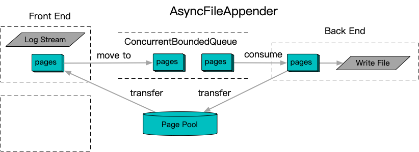

**[[简体中文]](README.zh-cn.md)**

# Logging

## Background and Principles

In server-side applications, logging typically involves decoupling the process of generating log entries from the actual writing to disk due to the unpredictable time required to complete write operations, which are influenced by various kernel and device factors. Most independent logging frameworks, such as [spdlog](https://github.com/gabime/spdlog) and [boost.log](https://github.com/boostorg/log), include built-in asynchronous mechanisms. Another widely used logging framework, [glog](https://github.com/google/glog), does not have a built-in asynchronous solution, but it offers extension points. In practice, frameworks like [Apollo](https://github.com/ApolloAuto/apollo/blob/master/cyber/logger/async_logger.h) and [brpc](https://github.com/apache/brpc/blob/master/src/butil/logging.cc) often include built-in asynchronous plugins.

However, common implementations tend to have a few typical performance bottlenecks:
- The synchronization mechanism used to decouple log assembly from log writing often relies on lock-based synchronization, which can degrade performance under high contention.
- Logs are often stored in memory blocks of variable lengths. This design usually involves dynamic memory allocation and deallocation, with cross-thread transfers that can bypass thread-local memory caches in allocators.
- Some implementations overlook the global lock issue associated with `localtime` calculations, which can also lead to multithreading contention.

A noteworthy logging framework, [NanoLog](https://github.com/PlatformLab/NanoLog), avoids the above-mentioned memory issues by using a thread-local caching mechanism. It also uses a unique static format spec to reduce the amount of information written to disk, which results in improved performance. However, this optimization is restricted to `printf`-like scenarios, and it is less compatible with streaming serialization systems (e.g., `operator<<`), limiting its applicability. Nevertheless, in scenarios where these restrictions are acceptable, NanoLog’s approach provides excellent performance by effectively addressing typical performance bottlenecks caused by contention.

Thread-local caching is a valuable optimization technique to reduce lock contention, but when combined with production environment challenges such as thread scaling and sporadic device delays, it requires significant increases in thread cache space to adapt. To address this, a solution combining a unified lock-free queue and a fixed-size lock-free memory pool is proposed: `AsyncFileAppender`. On the front end, a custom `streambuf` implemented on fixed-size paged memory captures log output into a paged-managed `LogEntry`. This `LogEntry` is then pushed into a central lock-free queue for asynchronous decoupling. The central `Appender` backend consumes these entries and completes the log writing, eventually releasing the pages back to the fixed-size memory pool for reuse in future log entries.

On top of `AsyncFileAppender`, a separate `Logger` layer was designed with two primary goals:
- The `Logger` layer adopts a hierarchical tree-based concept similar to [log4j](https://github.com/apache/logging-log4j2), offering complex management capabilities that are relatively rare in the C++ ecosystem. It aims to provide a similar framework but with memory management principles better aligned with C++.
- This decouples the `AsyncFileAppender` mechanism from the actual logging interface, offering a clean interface that can be integrated into existing logging frameworks in production environments. Even within Baidu, the most common usage of `AsyncFileAppender` is as a bottom-layer asynchronous solution integrated into existing internal logging systems, rather than as a standalone logging solution.
- The Babylon project also requires logging functionality, and a lightweight `Logger` layer allows users to integrate with their existing logging systems without requiring a complete switch to the `AsyncFileAppender` mechanism. For mature systems, this provides a more user-friendly integration method by offering flexibility in choosing the logging solution.

## Documentation

- [Logger](logger.en.md)
- [AsyncFileAppender](async_file_appender.en.md)

## Examples

- [Use async logger](../../example/use-async-logger)
- [Use with glog](../../example/use-with-glog)
