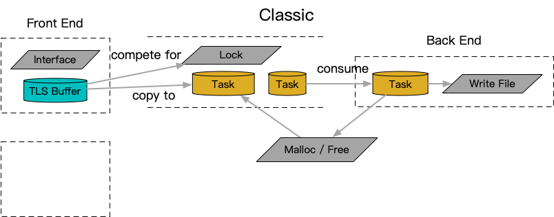
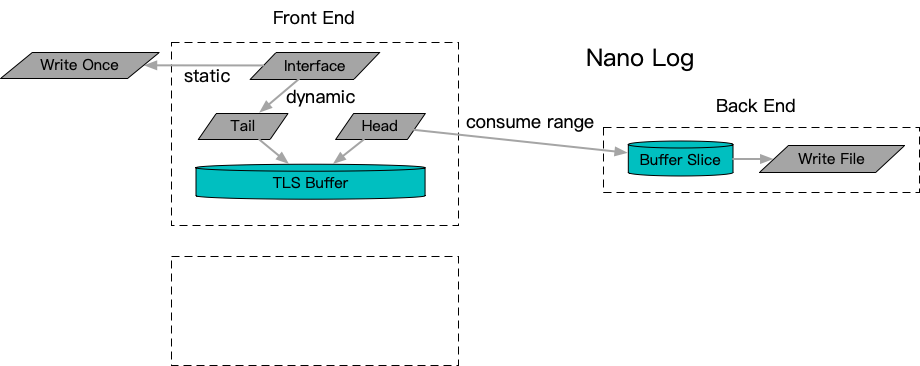
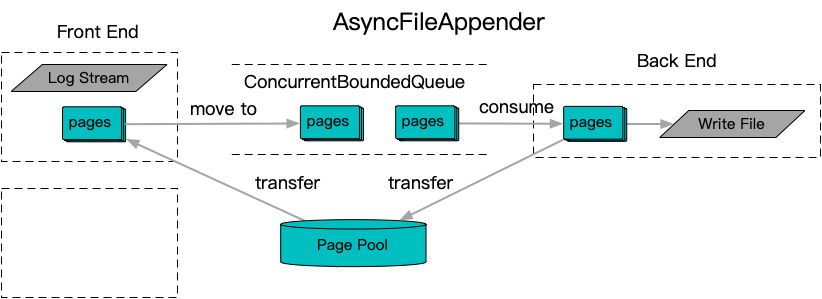
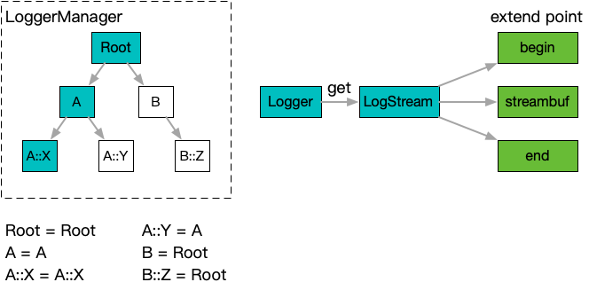

# logging

## 背景和原理

由于写入page cache的动作涉及较多不确定的内核和设备因素，完成时间不可控，因此典型的服务端程序在执行日志记录时都会通过异步衔接解耦日志的组装生成和实际的写入动作。大多数独立的日志框架例如[spdlog](https://github.com/gabime/spdlog)、[boost.log](https://github.com/boostorg/log)一般都包含内置的异步方案。另一个使用广泛的日志框架[glog](https://github.com/google/glog)虽然自身不包含异步方案，不过保留了一定的扩展点，实际采用的应用框架例如[apollo](https://github.com/ApolloAuto/apollo/blob/master/cyber/logger/async_logger.h)、[brpc](https://github.com/apache/brpc/blob/master/src/butil/logging.cc)等一般都包含内置的异步化插件方案。

但是目前的流行实现一般容易存在几个典型的性能阻塞点
- 用来解耦组装和写入的衔接机制往往采用了锁同步，对竞争激烈的场景会有明显的性能衰减
- 对于承载日志的内存块，由于其变长的特性，往往设计中存在变长动态内存申请和释放，而且申请和释放往往存在跨线程转移穿透内存分配器的线程缓存
- 有些实现对于localtime计算的[全局锁现象](../time.md)没有足够重视，同样会引起多线程竞争现象

值得一提的是一个独特的日志框架[NanoLog](https://github.com/PlatformLab/NanoLog)，采用线程缓存汇聚的逻辑避免了上述内存问题，同时采用了独特的静态format spec单独记录的方式结合按需还原降低了需要写入文件的信息量。只是优化限制了使用场景在类printf场景，对于streaming类的序列化体系（operator<<）比较难兼容，使用范围有一定制约和限制。不过能够接受这样的制约和限制的场景下，这套框架选择的线程缓存采集汇聚逻辑很好的解决了典型的性能阻塞竞争点，提供了很优异的性能。

抛开动静分离的特殊优化手段，线程缓存汇聚作为一种优化手段，尽管有效解决的锁竞争的问题，但是在线程增多并结合生产环境偶发设备卡顿时间增长的情况下，需要设置显著增多的线程缓存空间来进行适应。所以这里提出了一个结合统一的无锁队列，以及定长无锁内存池的解决方案AsyncFileAppender。在前端部分，通过一个在定长分页内存上实现的streambuf，将结果承接到一个分页管理的LogEntry上。之后将LogEntry送入中央无锁队列进行异步解耦，并由统一的Appender后端消费完成写入动作，最终分页释放回定长内存池，进入后续的前端流转。

进一步在AsyncFileAppender的之上，单独设计了Logger层的概念，主要出于两点考虑
- 单独的Logger层采用了类似[log4j](https://github.com/apache/logging-log4j2)的树型层次化概念，在c++生态中类似的复杂管理能力相对较少，希望能够提供一个类似思想，但又更符合c++内存管理理念的对标产品
- 将AsyncFileAppender整套机制和实际的日志接口解耦，提供尽可能干净的接口实现。便于实际在生产环境中，对接到业务服务实际使用日志框架。实际上即使在百度内部，AsyncFileAppender最广泛的使用方法依然是集成到内部更为广泛使用的已有日志接口框架下，作为底层异步能力来使用
- babylon内部也会有记录日志的需求，一个轻量的Logger层可以让用户更方便对接到自己已有的日志系统中去，而不是必然绑定用户整体切换到AsyncFileAppender机制。对于向成熟系统的集成，这可能是一种更有好的提供方式，给用户更符合其意愿的选择权

## 功能文档

- [logger](logger.md)
- [async_file_appender](async_file_appender.md)

## 典型用例

- [Use async logger](example/use-async-logger)
- [Use with glog](example/use-with-glog)
