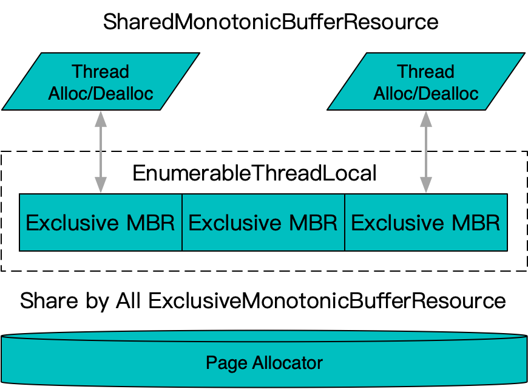

**[[简体中文]](memory_resource.zh-cn.md)**

# memory_resource

## Principle

Monotonic memory resources, functionally equivalent to `std::pmr::monotonic_buffer_resource`, are derived from `std::pmr::memory_resource` to support the `std::pmr::polymorphic_allocator` mechanism. They adopt a unified container type and support interfacing with different allocator implementations. The main differences are:

- Similar to `google::protobuf::Arena`, it provides the ability to register destructor functions, allowing it to manage the lifecycle of instances in addition to memory allocation.
- Offers both thread-safe and non-thread-safe implementations, with the thread-safe version using `thread_local` caching to reduce contention.
- It uses a fixed-size page allocator (`page_allocator`) for underlying allocation, unlike the variable-size allocation used by `std::pmr::monotonic_buffer_resource` and `google::protobuf::Arena`, reducing the pressure on `malloc`.

### ExclusiveMonotonicBufferResource


An exclusive monotonic memory resource, the basic implementation of monotonic memory resources. It is not thread-safe, and it batches multiple small allocation requests into full-page allocations from the underlying system, optimizing for scenarios with frequent small allocations.

### SharedMonotonicBufferResource



Composed of a series of thread-local exclusive memory resources. Each thread uses its corresponding exclusive resource for allocations.

### SwissMemoryResource

A lightweight extension of `SharedMonotonicBufferResource`, which also supports being used as a `google::protobuf::Arena`. This is achieved by patching protobuf’s internal implementation, with the patch automatically applied when possible. If the patch is not applicable due to version issues or link order, it falls back to using a real `google::protobuf::Arena`, still ensuring functionality, though memory allocation is not uniformly managed through the `PageAllocator`.

## Usage

```c++
#include <babylon/reusable/memory_resource.h>

using ::babylon::PageAllocator;
using ::babylon::ExclusiveMonotonicBufferResource;
using ::babylon::SharedMonotonicBufferResource;
using ::babylon::SwissMemoryResource;

// By default, new/delete are used to allocate memory from the system in whole pages
ExclusiveMonotonicBufferResource resource;
SharedMonotonicBufferResource resource;
SwissMemoryResource resource;

// Specify a page allocator to use for aggregating small allocations into full-page allocations, replacing the default SystemPageAllocator
PageAllocator& page_allocator = get_some_allocator();
resource.set_page_allocator(page_allocator);

// Specify an upstream allocator for large memory allocations, replacing the default std::pmr::new_delete_resource();
std::pmr::memory_resource& memory_resource = get_some_resource();
resource.set_upstream(memory_resource);

// Can be used as a memory_resource to support std::pmr containers directly
::std::pmr::vector<::std::pmr::string> pmr_vector(&resource);

// Can also be used directly for memory allocation
resource.allocate(bytes, alignment);

// Alignment can be further accelerated by passing it as a template parameter
resource.allocate<alignment>(bytes);

// Destructor functions can be registered with the memory resource, and they will be called when release is invoked
// instance.~T() will be called for destruction, but note that this only calls the destructor, and does not attempt to free the instance's memory
// This is typically used for interfaces that mimic the Create semantics of google::protobuf::Arena
T* instance;
resource.register_destructor(instance);

// A type-erased version of the destructor registration, supporting custom destruction methods
void destruct(void* instance) {
    reinterpret_cast<T*>(instance)->~T();
}
resource.register_destructor(instance, destruct);

// On release, all registered destructors are invoked first, and then the allocated memory is collectively freed
// Ensure that any std::pmr containers using this memory resource are destroyed before release is called
resource.release();

// Unique to SwissMemoryResource: it can be implicitly converted for use as an arena
google::protobuf::Arena& arena = swiss_memory_resource;
T* message_on_arena = google::protobuf::Arena::CreateMessage<T>(&arena);
```
