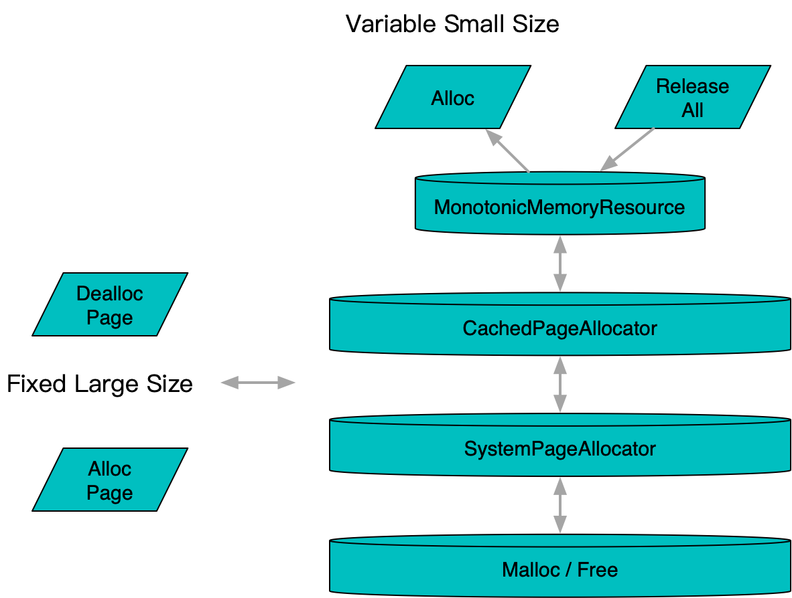

**[[简体中文]](page_allocator.zh-cn.md)**

# page_allocator

## Principle



A manager for allocating and freeing fixed-size memory blocks. Unlike general-purpose `malloc`, its fixed-size nature avoids complex implementations such as buddy algorithms, making it lighter and faster. In practical use, scattered small memory allocations are managed in aggregate through higher-level mechanisms like `memory_resource`.

### SystemPageAllocator

An allocator that allocates and frees memory in fixed system page sizes. It directly interfaces with `operator new` and `operator delete` at the system level.

### CachedPageAllocator

Frees memory blocks by caching them internally using `babylon::ConcurrentBoundedQueue` for reuse. When the cache overflows or underflows, it requests and releases memory from a lower-level allocator, such as `SystemPageAllocator`.

## Usage

```c++
#include <babylon/reusable/page_allocator.h>

using ::babylon::PageAllocator;
using ::babylon::SystemPageAllocator;
using ::babylon::CachedPageAllocator;

// The system page allocator is accessed as a singleton
auto& system_page_allocator = SystemPageAllocator::instance();

// The cached page allocator requires explicit construction
CachedPageAllocator cached_page_allocator;
// Set the upstream allocator from which memory blocks are retrieved, defaults to SystemPageAllocator::instance()
cached_page_allocator.set_upstream(page_allocator);
// Set the cache capacity
cached_page_allocator.set_free_page_capacity(128);

// Retrieve the page size, which defaults to the system page size, typically 4096
auto size = page_allocator.page_size();

// Allocation/Deallocation
void* pages[100];
page_allocator.allocate(pages, 100);
page_allocator.deallocate(pages, 100);

// Get the current number of cached pages and cache capacity
cached_page_allocator.free_page_num();
cached_page_allocator.free_page_capacity();

// Retrieve the current cache hit data
auto summary = cached_page_allocator.cache_hit_summary();
// summary.sum is the total number of cache hits
// summary.num is the total number of calls
// sum / num gives the hit rate, and calling this periodically to record the difference allows for hit rate monitoring
```
