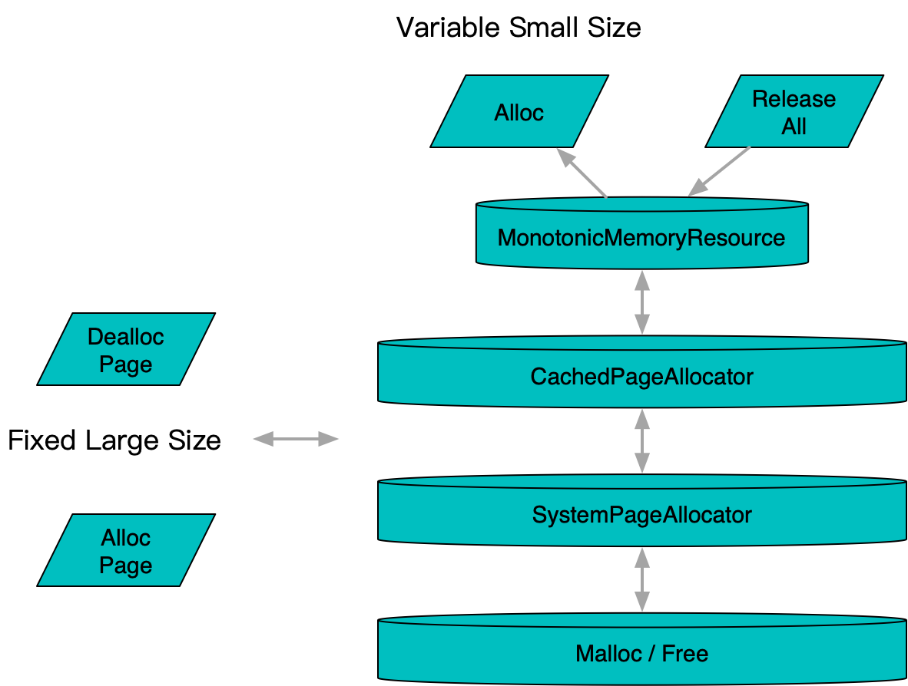

**[[English]](page_allocator.en.md)**

# page_allocator

## 原理



定长内存块的分配和释放管理器，与通用malloc典型的区别是因为其定长，避免了复杂的伙伴算法等复杂实现，更加轻量和快速。实际应用中，零散的小块内存申请通过更上层的memory_resource等方式进行聚集管理

### SystemPageAllocator

按照系统页定长申请释放的分配器，底层简单对接了operator new / operator delete

### CachedPageAllocator

释放的内存块首先通过babylon::ConcurrentBoundedQueue缓存在内部以便反复使用，在容量上溢和下溢的情况下从更底层的分配器，比如SystemPageAllocator来申请和释放

## 使用方法

```c++
#include <babylon/reusable/page_allocator.h>

using ::babylon::PageAllocator;
using ::babylon::SystemPageAllocator;
using ::babylon::CachedPageAllocator;

// 系统页分配器通过单例取得
auto& system_page_allocator = SystemPageAllocator::instance();

// 缓存页分配器需要主动构造
CachedPageAllocator cached_page_allocator;
// 设置穿透时从哪里获取内存块，默认为SystemPageAllocator::instance()
cached_page_allocator.set_upstream(page_allocator);
// 设置缓存容量
cached_page_allocator.set_free_page_capacity(128);

// 获取内存块大小，默认为系统页大小，典型为4096
auto size = page_allocator.page_size();

// 申请/释放
void* pages[100];
page_allocator.allocate(pages, 100);
page_allocator.deallocate(pages, 100);

// 获取当前缓存页数量/容量
cached_page_allocator.free_page_num();
cached_page_allocator.free_page_capacity();

// 获取当前命中率数据
auto summary = cached_page_allocator.cache_hit_summary();
// summary.sum为总命中量
// summary.num为总调用量
// sum / num可以得到命中率，周期调用并记录差值可以得到命中率监控
```
