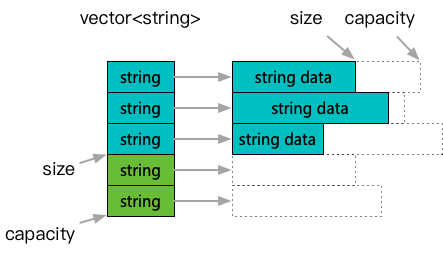
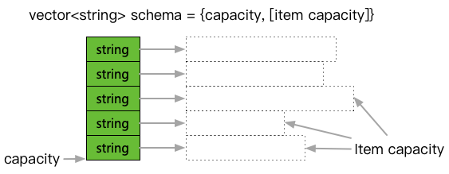

**[[简体中文]](traits.zh-cn.md)**

# traits

## Principle

This describes the traits required for achieving "perfect reuse," which combines the advantages of both memory pools and object pools. The concept is characterized by:

- Memory allocation on a contiguous memory pool, implemented via an accompanying allocator.
- Support for logical clearing, which means not actually destroying contained elements or freeing memory, but instead resetting usage markers to return to a logically initialized state. These elements can be reused when accessed again.
- Instances in the memory pool may intermittently exceed the previous maximum capacity, leading to new element allocations and breaking memory pool continuity, resulting in memory holes and waste. This problem is solved by periodically "recursively extracting capacity" and "reserving capacity" for new instances while maintaining memory continuity.



This image illustrates the meaning of logical clearing. Unlike typical `vector` operations, after shrinking in size via `clear` or `pop_back`, the objects inside are not actually destroyed; they are simply reset. Thus, when this slot is reused, the already constructed elements can be used directly.



This image illustrates the concept of reconstruction, where an auxiliary structure records the capacity of the memory and recursively records the capacity of each element. With this structure, the capacity can be recorded and restored in subsequent reconstructions, maintaining memory continuity. This concept is implemented through traits extraction rather than base class inheritance, primarily to support third-party implementations that cannot be modified, such as `google::protobuf::Message`.

## Usage

### Application Interface

```c++
#include <babylon/reusable/allocator.h>
#include <babylon/reusable/traits.h>

using ::babylon::ReusableTraits;
using ::babylon::Reuse;
using ::babylon::SwissAllocator;
using ::babylon::SwissMemoryResource;

SwissMemoryResource resource;
SwissAllocator allocator;

// REUSABLE is used to check if a type T implements the "perfect reuse" protocol
// Basic types, PODs, and Message types have built-in support by default
ReusableTraits<T>::REUSABLE

// A reusable instance is constructed similarly to a regular instance
auto instance = allocator.create_object(...);

// Repeated usage and clearing
loop:
  ... // Use the instance
  // Logically clear an instance
  Reuse::reconstruct(*instance, allocator);

// Structure to record instance capacity
Reuse::AllocationMetadata<T> meta;

// Extract capacity
Reuse::update_allocation_metadata(*instance, meta);

// Then, memory resources can be fully released
resource.release();

// Restore instance with recorded capacity and return to a contiguous memory state
instance = Reuse::create_with_allocation_metadata(allocator, meta);

... // Proceed to the next usage cycle

// For more details, see the comments
// Unit test: test/test_reusable_traits.cpp
```

### Extended Interface

```c++
#include <babylon/reusable/allocator.h>
#include <babylon/reusable/traits.h>

using ::babylon::ReusableTraits;
using ::babylon::SwissAllocator;

// Custom members supporting reuse
class SomeClass {
public:
    // This definition is not required for reuse traits, but for classes with dynamic memory, 
    // the allocator can be used to chain memory pools.
    using allocator_type = SwissAllocator<>;

    // Define a structure to store capacity metadata
    struct AllocationMetadata {
        ...
    };

    // Function to extract capacity
    void update_allocation_metadata(AllocationMetadata& meta) const {
        ...
    }

    // Constructor to restore capacity
    SomeClass(const AllocationMetadata& meta) {
        ...
    }
    // Constructor to restore capacity with a memory pool allocator
    SomeClass(const AllocationMetadata& meta, allocator_type allocator) {
        ...
    }

    // Logical clearing function
    void clear() {
        ...
    }
};
```
