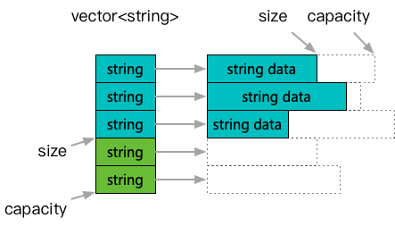
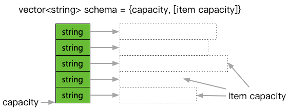

**[[English]](traits.en.md)**

# traits

## 原理

集合内存池与对象池双重优势的『完美重用』所需要的特征函数描述，概念体现为

- 内存分配在一块连续的内存池上，通过搭配allocator使用来实现
- 支持逻辑清空操作，即不真实销毁内含元素，也不释放其内存，通过重置用量标记等方式恢复到逻辑初始化的状态；再次使用时，优先复用这些子元素
- 内存池模式下反复使用实例，会间歇性因为超出之前的最大容量而申请新元素从而破坏内存池连续性，以及造成空洞浪费；通过定期『递归提取容量』并重新『预留容量』但内存连续的新实例来解决这个问题



这里展示了逻辑清空的含义，与典型的vector处理主要不同点是，在clear或者pop_back等操作缩减大小之后，内容对象并没有实际析构，只是清空重置。因此，再一次用到这个槽位的时候，可以直接拿到已经构造好的元素直接使用



这里展示了重建的含义，即设计一个辅助结构，记录其capacity和递归到每个元素的capacity；之后就可以借助这个结构记录，并在后续重新构造时进行容量还原
采用特征萃取而非基类继承的方式实现可重用概念的表达，主要用于支持一些不方便修改的第三方实现，典型例如google::protobuf::Message

## 使用方法

### 应用接口

```c++
#include <babylon/reusable/allocator.h>
#include <babylon/reusable/traits.h>

using ::babylon::ReusableTraits;
using ::babylon::Reuse;
using ::babylon::SwissAllocator;
using ::babylon::SwissMemoryResource;

SwissMemoryResource resource;
SwissAllocator allocator;

// REUSABLE用来判断一个类型T是否实现了『完美重用』协议
// 默认基础类型，pod以及Message等类型已经得到了内置支持
ReusableTriats<T>::REUSABLE

// 一个reusable实例初始构造和一般实例没有差异
auto instance = allocator.create_object(...);

// 反复使用和清理
loop:
  ... // 使用
  // 逻辑清理一个实例
  Reuse::reconstruct(*instance, allocator);

// 用来记录实例容量的结构
Reuse::AllocationMetadata<T> meta;

// 提取容量
Reuse::update_allocation_metadata(*instance, meta);

// 之后可以彻底释放内存资源
resource.release();

// 通过容量恢复实例，并重新回到内存连续状态
instance = Reuse::create_with_allocation_metadata(allocator, meta);

... // 进入下一个使用循环

// 更说明见注释
// 单测合并在test/test_reusable_traits.cpp
```

### 扩展接口

```c++
#include <babylon/reusable/allocator.h>
#include <babylon/reusable/traits.h>

using ::babylon::ReusableTraits;
using ::babylon::SwissAllocator;

// 通过自定义成员支持重用
class SomeClass {
public:
    // 这个定义并非重用特征的要求，不过一般包含动态内存的话，可以通过分配器级联应用内存池
    using allocator_type = SwissAllocator<>;
    
    // 需要定义指定名称的类来存储容量
    struct AllocationMetadata {
        ...
    };
    
    // 用来提取容量的函数
    void update_allocation_metadata(AllocationMetadata& meta) const {
        ...
    }
    
    // 用来容量还原的构造函数
    SomeClass(const AllocationMetadata& meta) {
        ...
    }
    // 应用内存池版本的容量还原构造
    SomeClass(const AllocationMetadata& meta, allocator_type allocator) {
        ...
    }
    
    // 逻辑清理函数
    void clear() {
        ...
    }
};
```
