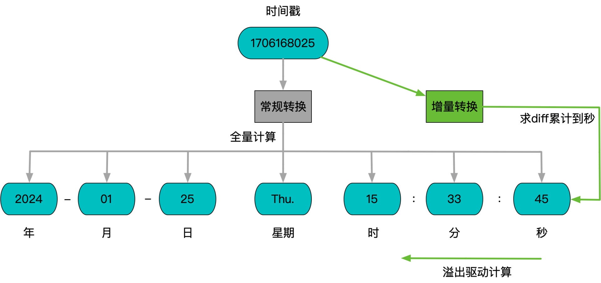

**[[简体中文]](time.zh-cn.md)**

# Time

## Principle

When servers perform time formatting (a common scenario being log formatting), they often rely on the `localtime_r` function. However, `localtime_r` is constrained by POSIX standards, requiring `tzset` to be called each time, which checks for changes in the time zone setting files and causes a global lock. These operations make it unsuitable for high-concurrency scenarios. While setting the TZ environment variable can circumvent file check actions, the impacts of the global lock remain unavoidable.

Typical industrial-grade logging systems usually address concurrency issues through replacement implementations. Known solutions include:

- `absl::TimeZone`, which is part of google/cctz
- `apollo::cyber::common::LocalTime`

These solutions eliminate the global lock. The implementation in `absl` is quite comprehensive, serving as a full-featured version of `localtime_r`. In contrast, the implementations in `comlog` and `apollo` simplify certain aspects, such as leap year calculations and daylight saving time support, optimizing performance relative to the full-featured version.

Here, we propose a new optimization mechanism based on caching, maintaining full functionality while extending and further optimizing practical performance in the most common logging formatting domain. Since natural time typically progresses gradually, the relatively complex calculations for leap years and weeks are unlikely to trigger in most incremental scenarios, saving significant computational overhead.



## Usage

```c++
#include "babylon/time.h"

time_t time = ...  // Obtain a timestamp

tm local;
babylon::localtime(&time, &local);
// Functions identically to localtime_r(&time, &local), except
// - Each process will load the time zone file only once, and runtime modifications to the system time zone will not be hot-loaded.
```

## Functionality/Performance Comparison

|             | Time Zone Hot Switch | Leap Year Support | Daylight Saving Time Support | Week Support | Single-thread Performance | Four-thread Performance |
|-------------|:--------------------:|:-----------------:|:---------------------------:|:------------:|:------------------------:|:----------------------:|
| localtime_r |          ✓           |         ✓         |              ✓              |      ✓       |          282ns          |        2061ns         |
| absl        |       Not Supported   |         ✓         |              ✓              |      ✓       |           91ns          |          92ns         |
| apollo      |       Not Supported   |      1901 ~ 2099  |         Not Supported        |  Not Supported|           11ns          |          11ns         |
| babylon     |       Not Supported   |         ✓         |              ✓              |      ✓       |            7ns          |           7ns         |
